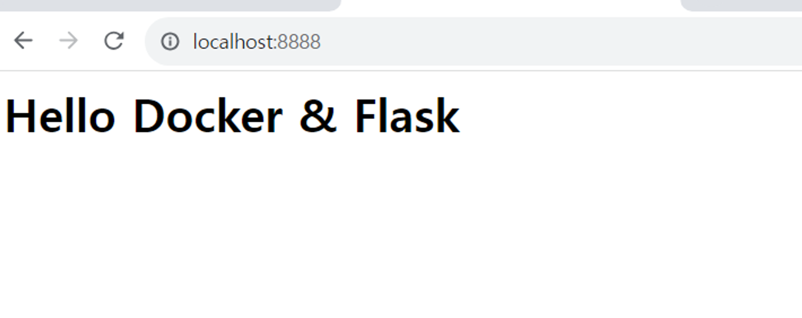
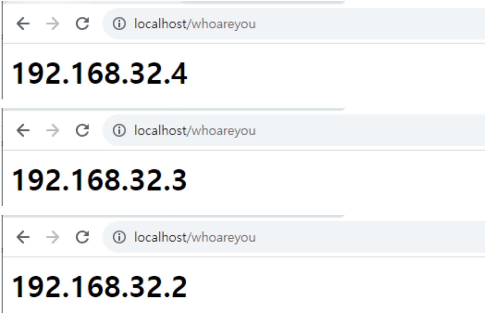

# Flask 웹 생성후 배포

# **Flask App Dockerize**

```powershell
C:\docker\docker-compose> cd ..
```

```powershell
C:\docker> mkdir flask
```

```powershell
C:\docker> cd flask
```

```powershell
C:\docker\flask>
```

```powershell
C:\docker\flask> pip install virtualenv
```

```powershell
C:\docker\flask> virtualenv venv
```

```powershell
C:\docker\flask> venv\Scripts\activate
```

```powershell
(venv) C:\docker\flask> pip install Flask
```

C:\docker\flask\[app.py](http://app.py/)

```python

from flask import Flask
app = Flask(__name__)

@app.route("/")
def hello():
    return "<h1>Hello Docker & Flask</h1>"

if __name__ == "__main__":
    app.run()
```

```powershell
(venv) C:\docker\flask> python app.py
 * Serving Flask app 'app'
 * Debug mode: off
WARNING: This is a development server. Do not use it in a production deployment. Use a production WSGI server instead.
 * Running on http://127.0.0.1:5000
Press CTRL+C to quit
```


```powershell
(venv) C:\docker\flask>python -m flask run --host=0.0.0.0
* Debug mode: off
WARNING: This is a development server. Do not use it in a production deployment. Use a production WSGI server instead.
 * Running on all addresses (0.0.0.0)
 * Running on http://127.0.0.1:5000
 * Running on http://172.20.132.134:5000
Press CTRL+C to quit
```

```powershell
(venv) C:\docker\flask> pip freeze > requirements.txt

(venv) C:\docker\flask> type requirements.txt

blinker==1.6.2
```

C:\docker\flask\Dockerfile

```python
FROM    python
WORKDIR /myapp
COPY    . .
RUN     pip3 install -r requirements.txt
CMD     ["python3", "-m", "flask", "run", "--host=0.0.0.0"]
```

```python
(venv) C:\docker\flask> docker image build -t myflask:1.0 .
```

```powershell
(venv) C:\docker\flask> docker image ls
REPOSITORY   TAG       IMAGE ID       CREATED         SIZE
myflask      1.0       24aece7e7db0   6 seconds ago   1.05GB

(venv) C:\docker\flask> docker container run -d -p 8888:5000 --rm --name myflask myflask:1.0
3485bf40432a7ecf361d61d8680b29ac2d148019092ff0a06d7db1a3b0929f86

(venv) C:\docker\flask> docker container ls
CONTAINER ID   IMAGE         COMMAND                   CREATED          STATUS          PORTS                    NAMES
3485bf40432a   myflask:1.0   "python3 -m flask ru…"   20 seconds ago   Up 16 seconds   0.0.0.0:8888->5000/tcp   myflask
```


/whoareyou 접속하면 현재 서버의 주소를 출력하도록 소스 코드를 수정한 후 도커 이미지로 만들고,

이미지를 Docker Compose를 이용해서 동일한 컨테이너를 여러 개 실행 후

http://localhost/whoareyou로 접속했을 때 컨테이너의 주소가 라운드 로빈되어서 출력

****app.py 수정****

```python
from flask import Flask, request
import socket

app = Flask(__name__)

@app.route("/")
def hello():
    return "<h1>Hello Docker & Flask</h1>"

@app.route("/whoareyou")
def whoareyou():
    s = socket.socket(socket.AF_INET, socket.SOCK_DGRAM)
    s.connect(("8.8.8.8", 53))
    ip = s.getsockname()[0]
    s.close()
return "<h1>"+ip+"</h1>"

if __name__ == "__main__":
    app.run()
```

**동작 테스트**

(venv) C:\docker\flask> python -m flask run --host=0.0.0.0


## **이미지 빌드**

```python
(venv) C:\docker\flask> docker image build -t myflask:2.0 .
```

## **컨테이너 실행**

```python
(venv) C:\docker\flask> docker container run -d -p 8080:5000 --rm --name myflask2 myflask:2.0
```

## **컨테이너의 IP 주소 확인**

```python
(venv) C:\docker\flask> docker container inspect myflask2

            "Networks": {
                "bridge": {
                    "IPAMConfig": null,
                    "Links": null,
                    "Aliases": null,
                    "NetworkID": "5c25d796d992bffa6e8579fb619fd2a842bc548fabcd970ed9577d6b5584b19f",
                    "EndpointID": "1bd77aca02fbb20f7e2f24f0b9dbe163a9a3b154197ff22bf7c18cfa4b388c2c",
                    "Gateway": "172.17.0.1",
                    "IPAddress": "172.17.0.2",
                    "IPPrefixLen": 16,
                    "IPv6Gateway": "",
                    "GlobalIPv6Address": "",
                    "GlobalIPv6PrefixLen": 0,
                    "MacAddress": "02:42:ac:11:00:02",
                    "DriverOpts": null
                }
            }
```


**nginx.conf 파일 작성**

```python
events {
    worker_connections 1000;
}

http {
    upstream all {
        server myflask:5000;
    }

    server {
        listen 80;
        location / {
            proxy_pass http://all/;
        }
    }
}
```

**docker-compose.yaml 파일 작성**

```python
version: "3.3"
services:
  myflask:
    image: myflask:2.0
    ports:
      - 5000
nginx:
    depends_on:
      - myflask
    image: nginx
    volumes:
      - .\nginx.conf:/etc/nginx/nginx.conf
    restart: always
    ports:
      - "80:80"
```

****컨테이너 실행****