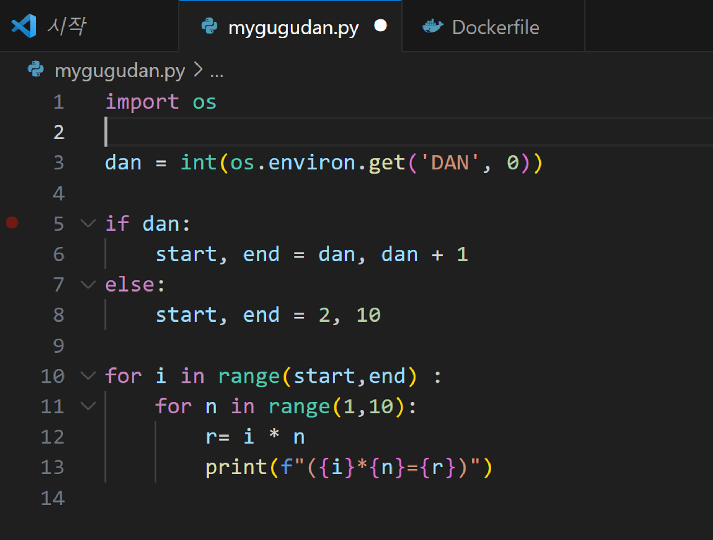

# 환경변수를 매개변수로 받는 파이썬 프로그램 작성후 배포

구구단을 출력하는 파이썬 프로그램을 작성하고, 해당 프로그램을 실행하는 도커 컨테이너 이미지를 생성 후 본인의 도커 허브에 등록

**#1 작업 디렉터리 생성**

```powershell
c:\docker\mywebserver> cd ..
c:\docker> mkdir mygugudan
c:\docker> cd mygugudan
```

**#2 구구단을 출력하는 파이썬 프로그램을 작성**


****#3 Dockerfile 작성****

```powershell
FROM python
WORKDIR /app
COPY mygugudan.py .
CMD ["python", "mygugudan.py"]
```

**#4 이미지 빌드**

```powershell
c:\docker\mygugudan> docker image build -t seojonghun/mygugudan:1.0 .

c:\docker\mygugudan> docker image ls
REPOSITORY             TAG       IMAGE ID       CREATED          SIZE
seojonghun/mygugudan     1.0       074fddc7f29a   20 seconds ago   1.01GB
```

**#5 컨테이너 실행**

```powershell
c:\docker\mygugudan> docker container run seojonghun/mygugudan:1.0
```

2단

==========

2 x 1 =  2

2 x 2 =  4

2 x 3 =  6

2 x 4 =  8

2 x 5 = 10

2 x 6 = 12

2 x 7 = 14

2 x 8 = 16

2 x 9 = 18

... (생략) ...

9단

==========

9 x 1 =  9

9 x 2 = 18

9 x 3 = 27

9 x 4 = 36

9 x 5 = 45

9 x 6 = 54

9 x 7 = 63

9 x 8 = 72

9 x 9 = 81

```powershell
c:\docker\mygugudan> docker container run -e DAN=3 seojonghun/mygugudan:1.0
```

3단

==========

3 x 1 =  3

3 x 2 =  6

3 x 3 =  9

3 x 4 = 12

3 x 5 = 15

3 x 6 = 18

3 x 7 = 21

3 x 8 = 24

3 x 9 = 27

환경변수 DAN=6입력시 출력 프롬프트



## **#6 이미지 등록**

c:\docker\mygugudan> docker image push seojonghun/mygugudan:1.0