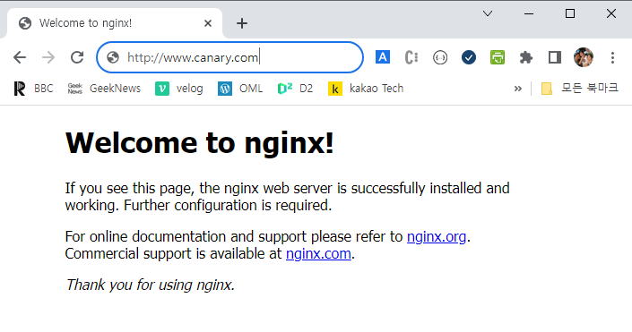
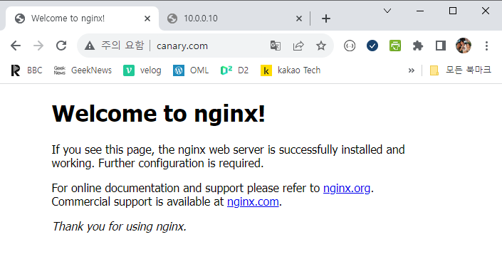
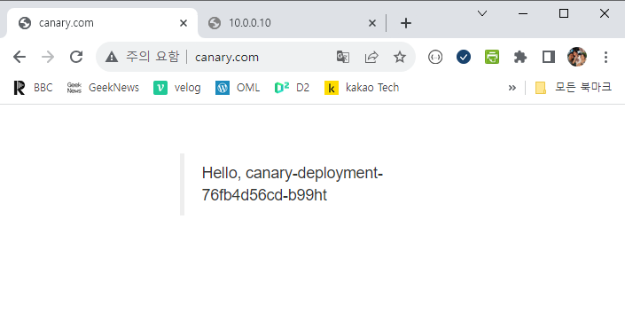

# ****Canary Ingress업데이트 실습****

****Blue/Green 업데이트 처럼 디플로이먼트 전략에서 제공하는 것이 아니고 Ingress를 이용해 구현****

****#1 metallb를 설치****

```powershell
vagrant@master-node:~$ kubectl get configmap kube-proxy -n kube-system -o yaml | \
    sed -e "s/strictARP: false/strictARP: true/" | \
    kubectl apply -f - -n kube-system
configmap/kube-proxy configured

vagrant@master-node:~$ kubectl apply -f https://raw.githubusercontent.com/metallb/metallb/v0.13.11/config/manifests/metallb-native.yaml
namespace/metallb-system created
	... (생략) ...
```

```powershell
vagrant@master-node:~$ cat routing-config.yaml

apiVersion: metallb.io/v1beta1
kind: IPAddressPool
metadata:
  name: first-pool
  namespace: metallb-system
spec:
  addresses:
  - 10.0.0.3-10.0.0.254
---
apiVersion: metallb.io/v1beta1
kind: L2Advertisement
metadata:
  name: example
  namespace: metallb-system
spec:
  ipAddressPools:
  - first-pool
```

****#2 nginx ingress controller 설치****

```powershell
vagrant@master-node:~$ kubectl apply -f https://raw.githubusercontent.com/kubernetes/ingress-nginx/contr
oller-v1.8.2/deploy/static/provider/baremetal/deploy.yaml
namespace/ingress-nginx created
	... (생략) ...
```

```powershell
vagrant@master-node:~$ kubectl get all -n ingress-nginx
NAME                                            READY   STATUS      RESTARTS   AGE
pod/ingress-nginx-admission-create-pczqr        0/1     Completed   0          35s
pod/ingress-nginx-admission-patch-hrz69         0/1     Completed   0          35s
pod/ingress-nginx-controller-79bc9f5df8-lwcwx   1/1     Running     0          35s

NAME                                         TYPE        CLUSTER-IP      EXTERNAL-IP   PORT(S)                      AGE
service/ingress-nginx-controller             NodePort    172.17.56.166   <none>        80:30141/TCP,443:32089/TCP   35s
service/ingress-nginx-controller-admission   ClusterIP   172.17.44.198   <none>        443/TCP                      35s
```

```powershell
vagrant@master-node:~$ kubectl edit service ingress-nginx-controller -n ingress-nginx

... (생략) ...
  selector:
    app.kubernetes.io/component: controller
    app.kubernetes.io/instance: ingress-nginx
    app.kubernetes.io/name: ingress-nginx
  sessionAffinity: None
  type: LoadBalancer				⇐ NodePort를 LoadBalancer로 변경하고 저장 후 종료
status:
  loadBalancer: {}
```

service/ingress-nginx-controller **edited**

```powershell
service/ingress-nginx-controller edited
```

****#3 웹 서비스를 제공하는 디플로이먼트, 서비스, 인그레스를 생성****

```powershell
/home/vagrant/production-deployment.yaml

apiVersion: apps/v1
kind: Deployment
metadata:
  name: production-deployment
spec:
  replicas: 3
  selector:
    matchLabels:
      app: nginx
  template:
    metadata:
      labels:
        app: nginx
    spec:
      containers:
      - name: nginx
        image: docker.io/nginx:1.14.2
        ports:
        - containerPort: 80
      imagePullSecrets:
      - name: regcred
```

```powershell
/home/vagrant/production-deployment.yaml

apiVersion: apps/v1
kind: Deployment
metadata:
  name: production-deployment
spec:
  replicas: 3
  selector:
    matchLabels:
      app: nginx
  template:
    metadata:
      labels:
        app: nginx
    spec:
      containers:
      - name: nginx
        image: docker.io/nginx:1.14.2
        ports:
        - containerPort: 80
      imagePullSecrets:
      - name: regcred
```

```powershell
/home/vagrant/production-ingress.yaml

apiVersion: networking.k8s.io/v1
kind: Ingress
metadata:
  name: production-ingress
spec:
  ingressClassName: nginx
  rules:
  - host: www.canary.com
    http:
      paths:
      - pathType: Prefix
        path: /
        backend:
          service:
            name: production-service
            port:
              number: 80
```

apply

```powershell
vagrant@master-node:~$ kubectl apply -f production-deployment.yaml
deployment.apps/production-deployment created

vagrant@master-node:~$ kubectl apply -f production-service.yaml
service/production-service created

vagrant@master-node:~$ kubectl apply -f production-ingress.yaml
ingress.networking.k8s.io/production-ingress created
```

```powershell
vagrant@master-node:~$ kubectl get pod
NAME                                     READY   STATUS    RESTARTS   AGE
production-deployment-768d775c57-8t4zg   1/1     Running   0          71s
production-deployment-768d775c57-g9sls   1/1     Running   0          71s
production-deployment-768d775c57-xsmlr   1/1     Running   0          71s

vagrant@master-node:~$ kubectl get service
NAME                 TYPE        CLUSTER-IP    EXTERNAL-IP   PORT(S)   AGE
kubernetes           ClusterIP   172.17.0.1    <none>        443/TCP   6d17h
production-service   ClusterIP   172.17.21.6   <none>        80/TCP    23m

vagrant@master-node:~$ kubectl get ingress
NAME                 CLASS   HOSTS            ADDRESS     PORTS   AGE
production-ingress   nginx   www.canary.com   10.0.0.11   80      9m57s
```

****#4 인그레스로 접속(요청을 전달)****

```powershell
vagrant@master-node:~$ kubectl get service -n ingress-nginx
NAME                                 TYPE           CLUSTER-IP      EXTERNAL-IP   PORT(S)                      AGE
ingress-nginx-controller             LoadBalancer   172.17.56.166   10.0.0.3      80:30141/TCP,443:32089/TCP   37m
ingress-nginx-controller-admission   ClusterIP      172.17.44.198   <none>        443/TCP                      37m

vagrant@master-node:~$ sudo vi /etc/hosts
10.0.0.3   www.canary.com		⇐ 해당 내용을 추가하고 저장 후 종료
```

```powershell
vagrant@master-node:~$ wget -q -O - http://www.canary.com
<!DOCTYPE html>
<html>
<head>
<title>Welcome to nginx!</title>
<style>
    body {
        width: 35em;
        margin: 0 auto;
        font-family: Tahoma, Verdana, Arial, sans-serif;
    }
</style>
```

내 PC의 C:\Windows\System32\drivers\etc\hosts 파일에 10.0.0.3 www.canary.com 내용을 추가해서 테스트도 가능

(메모장을 관리자 권한으로 실행해서 수정 후 저장)



****#5 새로운 버전의 디플로이먼트, 서비스를 생성****

```powershell
/home/vagrant/canary-deployment.yaml
apiVersion: apps/v1
kind: Deployment
metadata:
  name: canary-deployment
spec:
  replicas: 1								<<<
  selector:
    matchLabels:
      app: nginx-canary
  template:
    metadata:
      labels:
        app: nginx-canary
    spec:
      containers:
      - name: nginx-canary
        image: docker.io/alicek106/rr-test:echo-hostname		<<< 앞의 버전과 다른 이미지를 사용
        ports:
        - containerPort: 80
      imagePullSecrets:
      - name: regcred
```

```powershell
/home/vagrant/canary-service.yaml
apiVersion: v1
kind: Service
metadata:
  name: canary-service
spec:
  type: ClusterIP
  selector:
    app: nginx-canary
  ports:
    - protocol: TCP
      port: 80
      targetPort: 80
```

```powershell
vagrant@master-node:~$ kubectl apply -f canary-deployment.yaml
deployment.apps/canary-deployment created

vagrant@master-node:~$ kubectl apply -f canary-service.yaml
service/canary-service created
```

```powershell
vagrant@master-node:~$ kubectl get all
NAME                                         READY   STATUS    RESTARTS   AGE
pod/canary-deployment-76fb4d56cd-b99ht       1/1     Running   0          27s
pod/production-deployment-768d775c57-8t4zg   1/1     Running   0          43m
pod/production-deployment-768d775c57-g9sls   1/1     Running   0          43m
pod/production-deployment-768d775c57-xsmlr   1/1     Running   0          43m

NAME                         TYPE        CLUSTER-IP     EXTERNAL-IP   PORT(S)   AGE
service/canary-service       ClusterIP   172.17.8.138   <none>        80/TCP    18s
service/kubernetes           ClusterIP   172.17.0.1     <none>        443/TCP   6d17h
service/production-service   ClusterIP   172.17.21.6    <none>        80/TCP    43m

NAME                                    READY   UP-TO-DATE   AVAILABLE   AGE
deployment.apps/canary-deployment       1/1     1            1           27s
deployment.apps/production-deployment   3/3     3            3           43m

NAME                                               DESIRED   CURRENT   READY   AGE
replicaset.apps/canary-deployment-76fb4d56cd       1         1         1       27s
replicaset.apps/production-deployment-768d775c57   3         3         3       43m
```

production-deployment를 통해서 생성된 파드는 ingress를 통해서 외부에 노출되어 있으나,

canary-deployment를 통해서 생성된 파드는 외부에서 접근할 수 없는 상태

****#6 인그레스 추가****

```powershell
/home/vagrant/canary-ingress.yaml
apiVersion: networking.k8s.io/v1
kind: Ingress
metadata:
  name: canary-ingress
  annotations:
    nginx.ingress.kubernetes.io/canary: "true"		<<<
    nginx.ingress.kubernetes.io/canary-weight: "20"	<<<
spec:
  ingressClassName: nginx
  rules:
  - host: www.canary.com
    http:
      paths:
      - pathType: Prefix
        path: /
        backend:
          service:
            name: canary-service				<<< 
            port:
              number: 80
```

```powershell
vagrant@master-node:~$ kubectl apply -f canary-ingress.yaml
ingress.networking.k8s.io/canary-ingress created

vagrant@master-node:~$ kubectl get ingress
NAME                 CLASS   HOSTS            ADDRESS     PORTS   AGE
canary-ingress       nginx   www.canary.com   10.0.0.11   80      17s
production-ingress   nginx   www.canary.com   10.0.0.11   80      36m
```

```powershell
vagrant@master-node:~$ kubectl get service -n ingress-nginx
NAME                                 TYPE           CLUSTER-IP      EXTERNAL-IP   PORT(S)                      AGE
ingress-nginx-controller             LoadBalancer   172.17.56.166   10.0.0.3      80:30141/TCP,443:32089/TCP   63m
ingress-nginx-controller-admission   ClusterIP      172.17.44.198   <none>        443/TCP                      63m
```

### **#7 http://www.canary.com 으로 요청을 전달했을 때 요청이 분배되어 처리되는 것을 확인 ⇒ 이전 버전의 응답이 많은 것을 확인**





### **#8 /home/vagrant/canary-ingress.yaml 파일에 canary-weight를 변경**

```powershell
apiVersion: networking.k8s.io/v1
kind: Ingress
metadata:
  name: canary-ingress
  annotations:
    nginx.ingress.kubernetes.io/canary: "true"
    nginx.ingress.kubernetes.io/canary-weight: "80"	<<< 
spec:
  ingressClassName: nginx
  rules:
  - host: www.canary.com
    http:
      paths:
      - pathType: Prefix
        path: /
        backend:
          service:
            name: canary-service
            port:
              number: 80
```

## **#9 http://www.canary.com 으로 요청을 전달했을 때 요청이 분배되어 처리되는 것을 확인 ⇒ 신규 버전의 응답이 많은 것을 확인**

%**canary-weight를 100으로 변경하면 모든 요청이 신규 버전으로 전달되는 것을 확인**

**#11 리소스 정리**