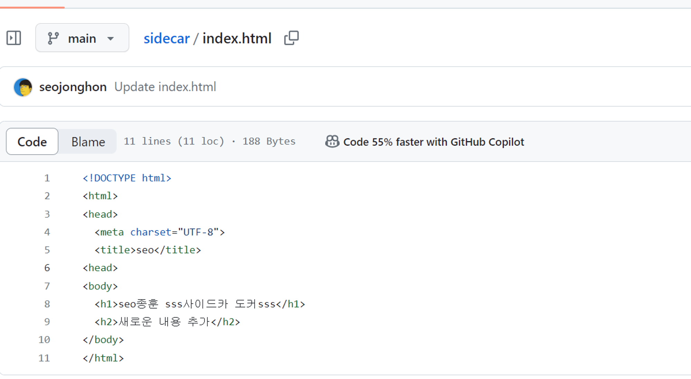
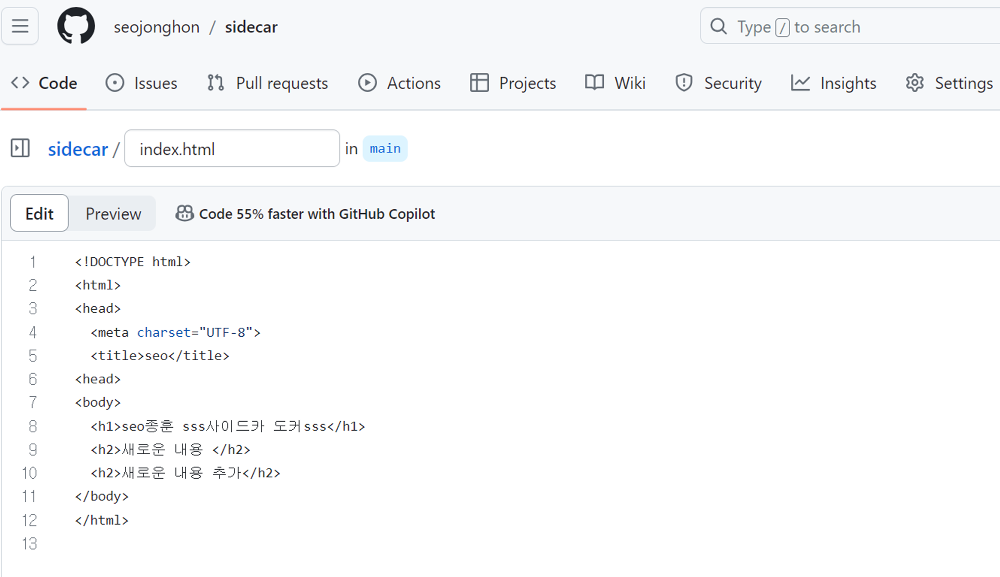

# 깃허브,도커허브에서 데이터 불러오기

## **Docker Desktop Kubernetes를 활용해서 테스트**

```powershell
C:\kubernetes\webserver.yaml
```

```yaml
apiVersion: v1
kind: Pod
metadata:
  name: webserver
spec:
  containers:
  - name: nginx
    image: nginx
    volumeMounts:
    - mountPath: /usr/share/nginx/html
      name: contents-vol
      readOnly: true
  - name: cloner
    image: myanjini/contents-cloner:1.0
    env:
    - name: CONTENTS_SOURCE_URL
      value: "https://github.com/myanjini/sidecar.git"
    volumeMounts:
    - mountPath: /data
      name: contents-vol
  volumes:
  - name: contents-vol
    emptyDir: {}
```

```yaml
C:\kubernetes> kubectl config get-contexts
CURRENT   NAME             CLUSTER          AUTHINFO         NAMESPACE
          docker-desktop   docker-desktop   docker-desktop
*         minikube         minikube         minikube         default
```

```yaml
C:\kubernetes> kubectl config use-context docker-desktop
Switched to context "docker-desktop".
```

```yaml
C:\kubernetes> kubectl config get-contexts
CURRENT   NAME             CLUSTER          AUTHINFO         NAMESPACE
*         docker-desktop   docker-desktop   docker-desktop
          minikube         minikube         minikube         default
```

```yaml
C:\kubernetes> kubectl apply -f webserver.yaml
pod/webserver created
```

```yaml
c:\kubernetes> kubectl get pod -o wide
NAME                         READY   STATUS    RESTARTS   AGE   IP          NODE             NOMINATED NODE   READINESS GATES
hello-k8s-75797f94b4-v8gvw   1/1     Running   0          28h   10.1.0.12   docker-desktop   <none>           <none>
webserver                    2/2     Running   0          51s   10.1.0.13   docker-desktop   <none>           <none>
```

### **대화형(=임시) 파드를 기동해서 파드의 초기 컨텐츠 출력**

```yaml
c:\kubernetes> kubectl run buybox --image=busybox --restart=Never --rm -it /bin/sh
If you don't see a command prompt, try pressing enter.
/ #
```

```yaml
/ # wget -q -O - http://10.1.0.13
<!DOCTYPE html>
<html>
<head>
  <meta charset="UTF-8">
  <title>seo</title>
</head>
<body>
  <h1>seo 종훈 sss사이드카 도커sss</h1>
	<h2>새로운 내용 추가</h2>
</body>
</html>
```



### **깃 허브 리포지터리의 컨텐츠를 수정하고 커밋**

### **대략 1분 후 wget을 통해 수정한 내용이 반영되는지 확인**


```yaml
/ # wget -q -O - http://10.1.0.13
<!DOCTYPE html>
<html>
<head>
  <meta charset="UTF-8">
  <title>seo</title>
</head>
<body>
  <h1>seo 종훈 sss사이드카 도커sss</h1>
  <h2>새로운 내용</h2>
	<h2>새로운 내용 추가</h2>
</body>
</html>
```
### **파드 삭제**

```yaml
/ # exit
pod "buybox" deleted
```

```powershell
c:\kubernetes> kubectl delete -f webserver.yaml

pod "webserver" deleted
```

```powershell
c:\kubernetes> kubectl get pod
NAME                         READY   STATUS    RESTARTS   AGE
hello-k8s-75797f94b4-v8gvw   1/1     Running   0          28h
```