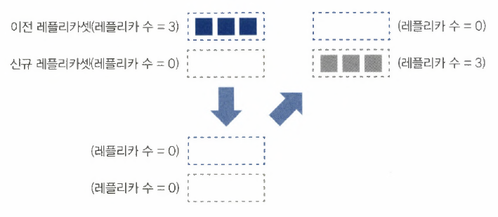
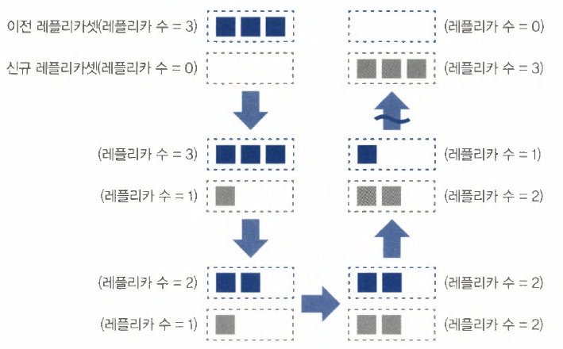

**디플로이먼트 배포 전략**

```powershell
Recreate
/home/vagrant/sample-deployment-recreate.yaml
```

```powershell
apiVersion: apps/v1
kind: Deployment
metadata:
  name: sample-deployment-recreate
spec:
  strategy:
    type: Recreate				<<<<< 기존 레플리카셋의 레플라 수를 0으로 하고 리소스를 반환
  replicas: 3				      신규 레플리카셋을 생성하고 레플리카 수를 늘림
  selector:
    matchLabels:
      app: sample-app
  template:
    metadata:
      labels:
        app: sample-app
    spec:
      containers:
      - name: nginx-container
        image: docker.io/nginx:1.16
      imagePullSecrets:
      - name: regcred
```



```powershell
vagrant@master-node:~$ kubectl apply -f sample-deployment-recreate.yaml
deployment.apps/sample-deployment-recreate created
```

```powershell
vagrant@master-node:~$ kubectl get replicaset,pod
NAME                                                   DESIRED   CURRENT   READY   AGE
replicaset.apps/sample-deployment-recreate-9ff76c956   3         3         3       45s

NAME                                             READY   STATUS    RESTARTS   AGE
pod/sample-deployment-recreate-9ff76c956-hd5vs   1/1     Running   0          45s
pod/sample-deployment-recreate-9ff76c956-s5dcq   1/1     Running   0          45s
pod/sample-deployment-recreate-9ff76c956-sf26d   1/1     Running   0          45s
```

### 리소스 상태에 변화가 있으면 출력

```powershell
vagrant@master-node:~$ kubectl get replicaset --watch
NAME                                   DESIRED   CURRENT   READY   AGE

sample-deployment-recreate-9ff76c956   3         3         3       96s
```

### 컨테이너 이미지를 업데이트

```powershell
vagrant@master-node:~$ kubectl set image deployment sample-deployment-recreate nginx-container=nginx:1.17
```

### 리소스(replicaset) 상태 확인

```powershell
sample-deployment-recreate-9ff76c956   3         3         3       96s
sample-deployment-recreate-9ff76c956   0         3         3       3m31s
sample-deployment-recreate-9ff76c956   0         3         3       3m31s
sample-deployment-recreate-9ff76c956   0         0         0       3m31s		⇐ 첫번째 RS을 종료 	--+ 일시적으로
sample-deployment-recreate-77dc8d9fb   3         0         0       0s		⇐ 새로운 RS을 생성     | 서비스 중단
sample-deployment-recreate-77dc8d9fb   3         0         0       0s 		                        | 발생
sample-deployment-recreate-77dc8d9fb   3         3         0       0s		                      --+
sample-deployment-recreate-77dc8d9fb   3         3         1       24s
sample-deployment-recreate-77dc8d9fb   3         3         2       25s
sample-deployment-recreate-77dc8d9fb   3         3         3       28s		⇐ 새로운 RS을 서비스
```

### 리소스 삭제

```powershell
vagrant@master-node:~$ kubectl delete -f sample-deployment-recreate.yaml
deployment.apps "sample-deployment-recreate" deleted
```

### **RollingUpdate**

```powershell
/home/vagrant/**sample-deployment-rollingupdate.yaml

apiVersion: apps/v1
kind: Deployment
metadata:
  name: sample-deployment-rollingupdate
spec:
  strategy:
    type: RollingUpdate			<<<<
    rollingUpdate:				
      maxUnavailable: 0			<<<< 업데이트 중 동시에 정지 가능한 최대 파드 수
      maxSurge: 1				<<<< 업데이트 중 동시에 생성할 수 있는 최대 파드 수 
  replicas: 3				     maxUnavailable과 maxSurge를 모두 0으로 설정할 수는 없음
  selector:
    matchLabels:
      app: sample-app
  template:
    metadata:
      labels:
        app: sample-app
    spec:
      containers:
      - name: nginx-container
        image: docker.io/nginx:1.16
      imagePullSecrets:
      - name: regcred**
```

```powershell
vagrant@master-node:~$ kubectl apply -f sample-deployment-rollingupdate.yaml
deployment.apps/sample-deployment-rollingupdate created

vagrant@master-node:~$ kubectl get rs,pod
NAME                                                        DESIRED   CURRENT   READY   AGE
replicaset.apps/sample-deployment-rollingupdate-9ff76c956   3         3         3       18s

NAME                                                  READY   STATUS    RESTARTS   AGE
pod/sample-deployment-rollingupdate-9ff76c956-fjlfc   1/1     Running   0          18s
pod/sample-deployment-rollingupdate-9ff76c956-npwbf   1/1     Running   0          18s
pod/sample-deployment-rollingupdate-9ff76c956-w2v2f   1/1     Running   0          18s
```

### 리소스 변경 상태를 모니터링

```powershell
vagrant@master-node:~$ kubectl get replicaset --watch
NAME                                        DESIRED   CURRENT   READY   AGE
sample-deployment-rollingupdate-9ff76c956   3         3         3       42s
```

### 이미지 업데이트

```powershell
vagrant@master-node:~$ kubectl set image deployment sample-deployment-rollingupdate nginx-container=nginx:1.17
```

### 리소스 변경 상태 확인

```powershell
vagrant@master-node:~$ kubectl get replicaset --watch
NAME                                        DESIRED   CURRENT   READY   AGE
sample-deployment-rollingupdate-9ff76c956   3         3         3       42s		#1 업데이트 전
sample-deployment-rollingupdate-77dc8d9fb   1         0         0       0s		#2 신규 1 추가
sample-deployment-rollingupdate-77dc8d9fb   1         0         0       0s
sample-deployment-rollingupdate-77dc8d9fb   1         1         0       0s
sample-deployment-rollingupdate-77dc8d9fb   1         1         1       2s		
sample-deployment-rollingupdate-9ff76c956   2         3         3       2m4s		#3 이전 1 감소	
sample-deployment-rollingupdate-77dc8d9fb   2         1         1       2s		#4 신규 1 추가
sample-deployment-rollingupdate-9ff76c956   2         3         3       2m4s
sample-deployment-rollingupdate-77dc8d9fb   2         1         1       2s
sample-deployment-rollingupdate-9ff76c956   2         2         2       2m4s		
sample-deployment-rollingupdate-77dc8d9fb   2         2         1       2s
sample-deployment-rollingupdate-77dc8d9fb   2         2         2       4s
sample-deployment-rollingupdate-9ff76c956   1         2         2       2m6s		#5 이전 1 감소
sample-deployment-rollingupdate-77dc8d9fb   3         2         2       4s
sample-deployment-rollingupdate-9ff76c956   1         2         2       2m6s
sample-deployment-rollingupdate-9ff76c956   1         1         1       2m6s
sample-deployment-rollingupdate-77dc8d9fb   3         2         2       4s		#6 신규 1 추가
sample-deployment-rollingupdate-77dc8d9fb   3         3         2       4s
sample-deployment-rollingupdate-77dc8d9fb   3         3         3       6s
sample-deployment-rollingupdate-9ff76c956   0         1         1       2m8s		#7 이전 1 감소
sample-deployment-rollingupdate-9ff76c956   0         1         1       2m8s
sample-deployment-rollingupdate-9ff76c956   0         0         0       2m8s
```

