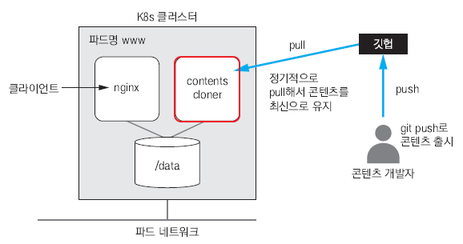
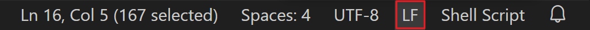
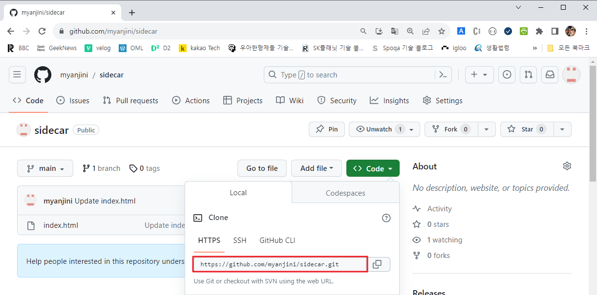

# 사이드카 패턴, 도커 허브

## **사이드카 패턴**



하나의 파드에 웹 서버 컨테이너와 깃허브에서 최신 컨텐츠를 다운받는 컨테이너를 조합

### **깃 허브에서 정기적으로 컨텐츠를 다운받는 쉘 스크립트를 작성**

```powershell
**C:\kubernetes> mkdir sidecar

C:\kubernetes> cd sidecar

C:\kubernetes\sidecar> code contents-cloner**
```

```powershell
#!/bin/bash

if [ -z $CONTENTS_SOURCE_URL ]; then

exit 1

fi

git clone $CONTENTS_SOURCE_URL /data

cd /data

while true

do

date

sleep 60

git pull
```



### **Dockerfile 작성**

```powershell
FROM    ubuntu:latest

RUN     apt-get update  &&  apt-get install -y git

COPY    ./contents-cloner  /contents-cloner

RUN     chmod  a+x  /contents-cloner

WORKDIR /

CMD     ["/contents-cloner"]
```

### **이미지 빌드 및 레지스트리에 등록**

```powershell
C:\kubernetes\sidecar> docker image build --tag seojonghun/contents-cloner:1.0 .
																								~~~~~~~~

																									본인의 도커 허브 계정
```

```powershell
C:\kubernetes\sidecar> docker image ls
REPOSITORY                 TAG   IMAGE ID       CREATED              SIZE
seojonghun/contents-cloner   1.0   d7806ba2d44c   About a minute ago   198MB
```

```powershell
C:\kubernetes\sidecar> docker login
Authenticating with existing credentials..
Login Succeeded
C:\kubernetes\sidecar> docker image push seojonghun/contents-cloner:1.0
```

### **깃 허브 레포지터리 주소를 확인**



### **사이드카 패턴의 파드를 생성하는 매니페스트를 작성**