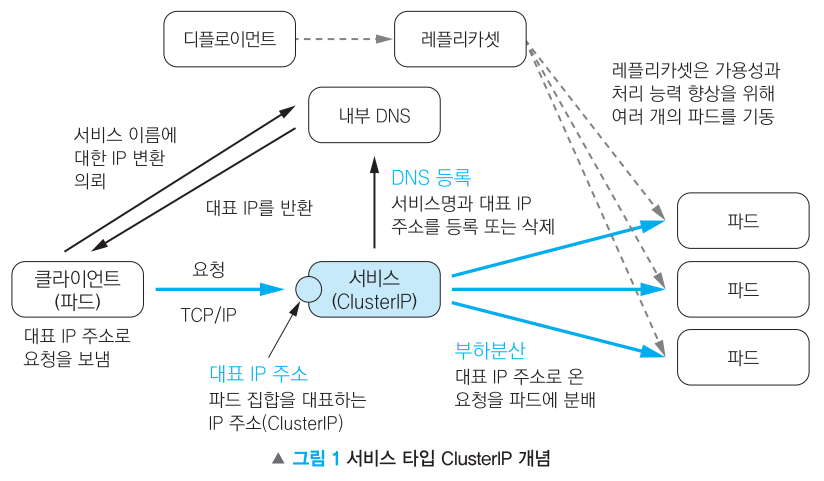

# 서비스(service)


파드를 연결하고 외부에 노출

## **서비스 기능**

- 여러 개의 파드에 쉽게 접근할 수 있도록 고유한 도메인 이름을 부여
- 여러 개의 파드에 접근할 때, 요청을 분산하는 로드 밸런서 기능을 수행
- 클라우드 플랫폼의 로드 밸런서, 클러서 노드의 포트 등을 통해 파드를 외부에 노출

## **서비스 타입**

ClusterIP		디폴트

클러스터 내부에서 파드들에 접근할 때 사용

외부로 파드를 노출하지 않기 때문에 클러스터 내부에서만 사용되는 파드에 적합

NodePort		파드에 접근할 수 있는 포트를 클러스터의 모든 노드에 동일하게 개방

외부에서 파드에 접근할 수 있는 서비스 타입

접근할 수 있는 포트는 랜덤으로 정해지지만, 특정 포트로 접근하도록 설정할 수 있음

LoadBalancer		클라우드 플랫폼에서 제공하는 로드벨런서를 동적으로 프로비저닝해 파드에 연결

NodePort 타입과 마찬가지로 외부에서 파드에 접근할 수 있는 서비스 타입

일반적으로 AWS, GCP 등과 같은 클라우스 플랫폼 환경에서 사용

ExternalName		외부 서비스를 쿠버네티스 내부에서 호출하고자 할 때 사용

클러스터 내의 파드에서 외부 IP 주소에 서비스의 이름으로 접근할 수 있음

## **서비스를 생성하는 방법**

매니페스트(YAML)을 이용해서 생성

kubectl expose 명령을 사용해서 생성

## **디플로이먼트로 파드를 생성하고, 생성한 파드로 요청을 전달**

### **#1 디플로먼트 생성**

```powershell
/home/vagrant/**hostname-deployment.yaml**
```

```powershell
apiVersion: apps/v1
kind: Deployment
metadata:
  name: hostname-deployment
spec:
  replicas: 3
  selector:
    matchLabels:
      app: webserver
  template:
    metadata:
      labels:
        app: webserver
      name: my-webserver
    spec:
      containers:
      - name: my-webserver
        image: docker.io/alicek106/rr-test:echo-hostname
        ports:
        - containerPort: 80
      imagePullSecrets:
      - name: regcred
```

파드에서 제공하는 웹 서비스를 이용하기 위해 파드의 NAME과 IP를 확인

```powershell
vagrant@master-node:~$ kubectl apply -f hostname-deployment.yaml
deployment.apps/hostname-deployment created

vagrant@master-node:~$ kubectl get pod -o wide ⇐ 파드에서 제공하는 웹 서비스를 이용하기 위해 파드의 NAME과 IP를 확인
NAME                                   READY   STATUS    RESTARTS   AGE   IP              NODE            NOMINATED NODE   READINESS GATES
hostname-deployment-7d4f978855-8h2m9   1/1     Running   0          41s   172.16.158.8    worker-node02   <none>           <none>
hostname-deployment-7d4f978855-pzkgc   1/1     Running   0          41s   172.16.87.234   worker-node01   <none>           <none>
hostname-deployment-7d4f978855-v7zlc   1/1     Running   0          41s   172.16.158.7    worker-node02   <none>           <none>
```

### **#2 임시 파드를 실행해서 디플로이한 파드의 IP 주소로 요청을 전달**

```powershell
vagrant@master-node:~$ kubectl run -it --rm debug --image=docker.io/busybox --restart=Never sh

If you don't see a command prompt, try pressing enter.
/ #  wget -q -O - http://172.16.158.8 | grep Hello
        <p>Hello,  hostname-deployment-7d4f978855-8h2m9</p>     </blockquote>

/ #  wget -q -O - http://172.16.87.234 | grep Hello
        <p>Hello,  hostname-deployment-7d4f978855-pzkgc</p>     </blockquote>

/ #  wget -q -O - http://172.16.158.7 | grep Hello
        <p>Hello,  hostname-deployment-7d4f978855-v7zlc</p>     </blockquote>
```

## **파드 IP 주소를 기반으로 애플리케이션 파드에 접근했을 때 문제점**

### **#1 파드가 수시로 삭제, 생성되는 과정에서 애플리케이션 파드의 IP 주소가 변경될 수 있음**

⇒ 클라이언트 파드가 변경된 애플리케이션 파드의 IP 주소를 알 수 없음 → 이름을 기반으로 애플리케이션 파드에 접근할 수 있는 방안이 필요

### **#2 클라이언트 파드는 자신이 알고 있는 애플리케이션 파드의 IP로만 접근**

⇒ 부하가 특정 파드로 집중될 수 있음 → 로드밸런싱 기능이 필요

## **ClusterIP 타입의 서비스**



### **#1 서비스 생성**

```powershell
/home/vagrant/**hostname-service-clusterip.yaml

apiVersion: v1
kind: Service
metadata:
  name: hostname-service-clusterip
spec:
  type: ClusterIP     # 서비스 타입 (기본값이 ClusterIP)
  selector:           # 어떤 라벨의 파드에 접근할 수 있게 만들 것인지 결정
    app: webserver    # 파드의 라벨
  ports:
  - name: web-port
    port: 8080        # 서버스의 IP에 접근할 때 사용할 포트
    targetPort: 80    # selector 항목에서 정의한 라벨에 의해 접근 대상이 된 파드 내부에서 사용하는 포트**
```

****#2 서비스 생성 및 확인****

```powershell
vagrant@master-node:~$ kubectl apply -f hostname-service-clusterip.yaml
service/hostname-service-clusterip created

vagrant@master-node:~$ kubectl get service
NAME                         TYPE        CLUSTER-IP      EXTERNAL-IP   PORT(S)    AGE
hostname-service-clusterip   ClusterIP   172.17.17.106   <none>        8080/TCP   16s
                                         ~~~~~~~~~~~~~                 ~~~~
                                         CLUSTER-IP가 172.17.17.106이고, 포트 번호가 8080인 서비스     
kubernetes                   ClusterIP   172.17.0.1      <none>        443/TCP    4d21h
~~~~~~~~~~
쿠버네티스 API에 접근하기 위한 서비스 

CLUSTER-IP ⇒ 쿠버네트스 클러스터에서만 사용할 수 있는 내부 IP로, 이 IP를 통해 서비스에 연결된 파드로 접근이 가능 
```

### **#3 임시 파드 생성 후 서비스의 CLUSTER-IP와 PORT로 요청을 전송**

```powershell
vagrant@master-node:~$ kubectl get pod -o wide

NAME                                   READY   STATUS    RESTARTS   AGE   IP              NODE            NOMINATED NODE   READINESS GATES
hostname-deployment-7d4f978855-8h2m9   1/1     Running   0          57m   172.16.158.8    worker-node02   <none>           <none>
hostname-deployment-7d4f978855-pzkgc   1/1     Running   0          57m   172.16.87.234   worker-node01   <none>           <none>
hostname-deployment-7d4f978855-v7zlc   1/1     Running   0          57m   172.16.158.7    worker-node02   <none>           <none>
```

```powershell
vagrant@master-node:~$ kubectl run -it --rm debug --image=docker.io/busybox --restart=Never sh
If you don't see a command prompt, try pressing enter.
/ #
/ # ip a

eth0@if29: <BROADCAST,MULTICAST,UP,LOWER_UP,M-DOWN> mtu 1480 qdisc noqueue qlen 1000
    link/ether 12:ec:45:ca:a1:ec brd ff:ff:ff:ff:ff:ff
    inet 172.16.158.12/32 scope global eth0
       valid_lft forever preferred_lft forever
```

서비스에 연결된 파드로 로드밸런싱되는 것을 확인

```powershell
/ # wget -q -O - http://172.17.17.106:8080 | grep Hello		⇐ 서비스의 CLUSTER-IP와 PORT로 접근
        <p>Hello,  hostname-deployment-7d4f978855-8h2m9</p>     	⇐ 서비스에 연결된 파드로 로드밸런싱되는 것을 확인
/ # wget -q -O - http://172.17.17.106:8080 | grep Hello
        <p>Hello,  hostname-deployment-7d4f978855-pzkgc</p>     </blockquote>
/ # wget -q -O - http://172.17.17.106:8080 | grep Hello
        <p>Hello,  hostname-deployment-7d4f978855-v7zlc</p>     </blockquote>
```

### **#4 서버스의 NAME과 PORT로 요청을 전달**

쿠버네티스는 애플리케이션이 서비스나 파드를 쉽게 찾을 수 있도록 내부 DNS를 구동

```powershell
/ # wget -q -O - http://hostname-service-clusterip:8080 | grep Hello	⇐ 서비스의 NAME과 PORT로 접근
        <p>Hello,  hostname-deployment-7d4f978855-pzkgc</p>     </blockquote>
/ # wget -q -O - http://hostname-service-clusterip:8080 | grep Hello
        <p>Hello,  hostname-deployment-7d4f978855-8h2m9</p>     </blockquote>
/ # wget -q -O - http://hostname-service-clusterip:8080 | grep Hello
        <p>Hello,  hostname-deployment-7d4f978855-v7zlc</p>     </blockquote>
```

****#5 (다른 터미널에서) 파드 하나를 삭제****

```powershell
vagrant@master-node:~$ kubectl get pod
NAME                                   READY   STATUS    RESTARTS   AGE
debug                                  1/1     Running   0          6m51s
hostname-deployment-7d4f978855-8h2m9   1/1     Running   0          64m		
hostname-deployment-7d4f978855-pzkgc   1/1     Running   0          64m
hostname-deployment-7d4f978855-v7zlc   1/1     Running   0          64m
```

새로운 파드가 추가

```powershell
vagrant@master-node:~$ kubectl delete pod hostname-deployment-7d4f978855-8h2m9
pod "hostname-deployment-7d4f978855-8h2m9" deleted

vagrant@master-node:~$ kubectl get pod
NAME                                   READY   STATUS    RESTARTS   AGE
debug                                  1/1     Running   0          8m3s
hostname-deployment-7d4f978855-pzkgc   1/1     Running   0          66m
hostname-deployment-7d4f978855-v7zlc   1/1     Running   0          66m
hostname-deployment-7d4f978855-w54fq   1/1     Running   0          38s		⇐ 새로운 파드가 추가
```

****#6 (원래 터미널에서) 서비스로 접근했을 때 새로 생성된 파드로 요청이 전달되는 것을 확인****

```powershell
/ # wget -q -O - http://hostname-service-clusterip:8080 | grep Hello
        <p>Hello,  hostname-deployment-7d4f978855-w54fq</p>     </blockquote>	⇐ 새로운 파드로 요청이 전달
/ # wget -q -O - http://hostname-service-clusterip:8080 | grep Hello
        <p>Hello,  hostname-deployment-7d4f978855-v7zlc</p>     </blockquote>
/ # wget -q -O - http://hostname-service-clusterip:8080 | grep Hello
        <p>Hello,  hostname-deployment-7d4f978855-pzkgc</p>     </blockquote>
```

### **#7 대화형 파드에서 hostname-service-clusterip 서비스로 반복해서 요청을 전달하는 스크립트를 실행 → 반환되는 호스트명이 라운드로빈 방식으로 출력되는 것을 확인**

```powershell
/ # while true; do wget -q -O - http://hostname-service-clusterip:8080 | grep Hello; sleep 1; done
<p>Hello,  hostname-deployment-7d4f978855-pzkgc</p>     </blockquote>
        <p>Hello,  hostname-deployment-7d4f978855-w54fq</p>     </blockquote>
        <p>Hello,  hostname-deployment-7d4f978855-w54fq</p>     </blockquote>
        <p>Hello,  hostname-deployment-7d4f978855-v7zlc</p>     </blockquote>
        <p>Hello,  hostname-deployment-7d4f978855-w54fq</p>     </blockquote>
        <p>Hello,  hostname-deployment-7d4f978855-v7zlc</p>     </blockquote>
        <p>Hello,  hostname-deployment-7d4f978855-pzkgc</p>     </blockquote>
        <p>Hello,  hostname-deployment-7d4f978855-pzkgc</p>     </blockquote>
        <p>Hello,  hostname-deployment-7d4f978855-w54fq</p>     </blockquote>
        <p>Hello,  hostname-deployment-7d4f978855-pzkgc</p>     </blockquote>
        <p>Hello,  hostname-deployment-7d4f978855-pzkgc</p>     </blockquote>
        <p>Hello,  hostname-deployment-7d4f978855-w54fq</p>     </blockquote>
        <p>Hello,  hostname-deployment-7d4f978855-v7zlc</p>     </blockquote>
        <p>Hello,  hostname-deployment-7d4f978855-v7zlc</p>     </blockquote>
        <p>Hello,  hostname-deployment-7d4f978855-w54fq</p>     </blockquote>
^C
```

### **#8 서비스 생성 후 실행되는 파드에는 서비스와 관련한 환경 변수가 설정되어 있음**

```powershell
/ # env | grep HOSTNAME_SERVICE_CLUSTERIPHOSTNAME_SERVICE_CLUSTERIP_SERVICE_HOST=172.17.17.106
HOSTNAME_SERVICE_CLUSTERIP_PORT_8080_TCP_ADDR=172.17.17.106
HOSTNAME_SERVICE_CLUSTERIP_PORT_8080_TCP_PORT=8080
HOSTNAME_SERVICE_CLUSTERIP_SERVICE_PORT_WEB_PORT=8080
HOSTNAME_SERVICE_CLUSTERIP_PORT_8080_TCP_PROTO=tcp
HOSTNAME_SERVICE_CLUSTERIP_SERVICE_PORT=8080
HOSTNAME_SERVICE_CLUSTERIP_PORT=tcp://172.17.17.106:8080
HOSTNAME_SERVICE_CLUSTERIP_PORT_8080_TCP=tcp://172.17.17.106:8080
```

## **세션 어피니티(sessionAffinity) ⇒ 클라이언트 IP 별로 전송 파드를 고정**

### **#1 /home/vagrant/hostname-service-clusterip.yaml 파일을 수정**

클라이언트 IP 주소에 따라 요청을 처리할 파드가 결정

```powershell
apiVersion: v1
kind: Service
metadata:
  name: hostname-service-clusterip
spec:
  type: ClusterIP
  selector:
    app: webserver
  ports:
  - name: web-port
    port: 8080
    targetPort: 80
  sessionAffinity: ClientIP # 클라이언트 IP 주소에 따라 요청을 처리할 파드가 결정
```

클라이언트 IP 주소에 따라 요청을 처리할 파드가 결정

```powershell
vagrant@master-node:~$ kubectl apply -f hostname-service-clusterip.yaml
service/hostname-service-clusterip configured
```

```powershell
vagrant@master-node:~$ kubectl get pod,service -o wide
NAME                                       READY   STATUS    RESTARTS   AGE   IP              NODE            NOMINATED NODE   READINESS GATES
pod/hostname-deployment-7d4f978855-pzkgc   1/1     Running   0          81m   172.16.87.234   worker-node01   <none>           <none>
pod/hostname-deployment-7d4f978855-v7zlc   1/1     Running   0          81m   172.16.158.7    worker-node02   <none>           <none>
pod/hostname-deployment-7d4f978855-w54fq   1/1     Running   0          16m   172.16.87.235   worker-node01   <none>           <none>

NAME                                 TYPE        CLUSTER-IP      EXTERNAL-IP   PORT(S)    AGE     SELECTOR
service/hostname-service-clusterip   ClusterIP   172.17.17.106   <none>        8080/TCP   29m     app=webserver
service/kubernetes                   ClusterIP   172.17.0.1      <none>        443/TCP    4d22h   <none>
```

### **#3 대화형 파드에서 hostname-service-clusterip 서비스로 반복해서 요청을 전달**

```powershell
vagrant@master-node:~$ kubectl run -it --rm debug --image=docker.io/busybox --restart=Never sh
If you don't see a command prompt, try pressing enter.
```

```powershell
/ # ip a
...
eth0@if30: <BROADCAST,MULTICAST,UP,LOWER_UP,M-DOWN> mtu 1480 qdisc noqueue qlen 1000
    link/ether 8a:aa:2e:24:e7:41 brd ff:ff:ff:ff:ff:ff
    inet 172.16.158.13/32 scope global eth0
```

```powershell
/ # while true; do wget -q -O - http://hostname-service-clusterip:8080 | grep Hello; sleep 1; done
        <p>Hello,  hostname-deployment-7d4f978855-v7zlc</p>     </blockquote>	⇐ 동일한 파드가 응답하는 것을 확인
        <p>Hello,  hostname-deployment-7d4f978855-v7zlc</p>     </blockquote>
        <p>Hello,  hostname-deployment-7d4f978855-v7zlc</p>     </blockquote>
        <p>Hello,  hostname-deployment-7d4f978855-v7zlc</p>     </blockquote>
        <p>Hello,  hostname-deployment-7d4f978855-v7zlc</p>     </blockquote>
        <p>Hello,  hostname-deployment-7d4f978855-v7zlc</p>     </blockquote>
        <p>Hello,  hostname-deployment-7d4f978855-v7zlc</p>     </blockquote>
        <p>Hello,  hostname-deployment-7d4f978855-v7zlc</p>     </blockquote>
        <p>Hello,  hostname-deployment-7d4f978855-v7zlc</p>     </blockquote>
^C
```

### **#4 (다른 터미널에서) #3 과정을 동일하게 진행**

```powershell
vagrant@master-node:~$ kubectl run -it --rm debug2 --image=docker.io/busybox --restart=Never sh
```

```powershell
/ # ip a
eth0@if31: <BROADCAST,MULTICAST,UP,LOWER_UP,M-DOWN> mtu 1480 qdisc noqueue qlen 1000
    link/ether 32:36:81:9e:a5:f4 brd ff:ff:ff:ff:ff:ff
    inet 172.16.158.14/32 scope global eth0
```

```powershell
/ # while true; do wget -q -O - http://hostname-service-clusterip:8080 | grep Hello; sleep 1; done
        <p>Hello,  hostname-deployment-7d4f978855-w54fq</p>     </blockquote>
        <p>Hello,  hostname-deployment-7d4f978855-w54fq</p>     </blockquote>
        <p>Hello,  hostname-deployment-7d4f978855-w54fq</p>     </blockquote>
        <p>Hello,  hostname-deployment-7d4f978855-w54fq</p>     </blockquote>
        <p>Hello,  hostname-deployment-7d4f978855-w54fq</p>     </blockquote>
```

### **#5 리소스 정리**