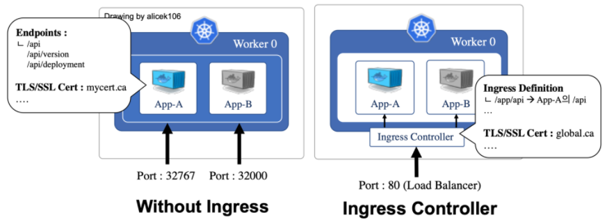
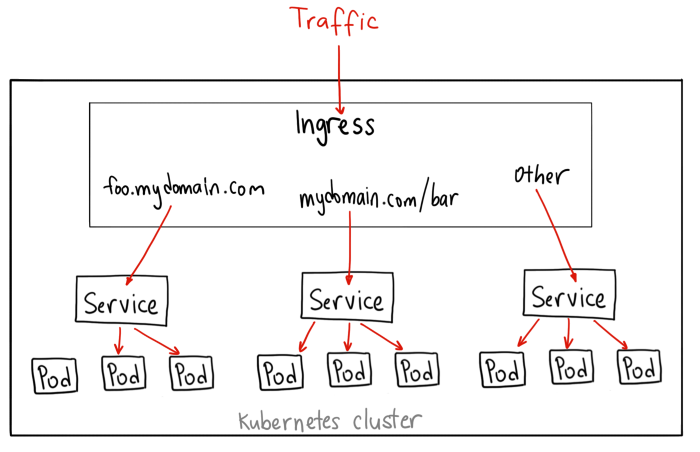
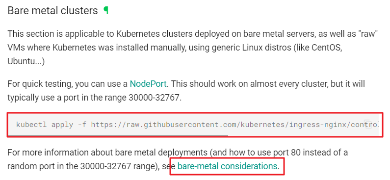

# 인그래스(ingress)

일반적으로 외부에서 내부로 향하는 것을 지칭하는 단어

## **주요 기능**

외부 요청의 라우팅

가상 호스트 기반의 요청 처리

SSL/TLS 보안 연결 처리

⇒ 인그레스를 사용하려면 인그레스 컨트롤러가 필요





# 

## **디플로이먼트와 서비스 생성**

### **#1 3개의 파드를 실행하는 webserver1과 webserver2 디플로이먼트를 생성**

```powershell
/home/vagrant/webserver1.yaml

apiVersion: apps/v1
kind: Deployment
metadata:
  name: webservice1
spec:
  replicas: 3
  selector:
    matchLabels:
      app: web1
  template:
    metadata:
      labels:
        app: web1
    spec:
      containers:
      - name: web1
        image: docker.io/alicek106/rr-test:echo-hostname
        ports:
        - containerPort: 80
      imagePullSecrets:
      - name: regcred
```

```powershell
/home/vagrant/webserver2.yaml

apiVersion: apps/v1
kind: Deployment
metadata:
  name: webservice2
spec:
  replicas: 3
  selector:
    matchLabels:
      app: web2
  template:
    metadata:
      labels:
        app: web2
    spec:
      containers:
      - name: web2
        image: docker.io/alicek106/rr-test:echo-hostname
        ports:
        - containerPort: 80
      imagePullSecrets:
      - name: regcred
```

```powershell
/home/vagrant/service1.yaml
apiVersion: v1
kind: Service
metadata:
  name: service1
spec:
  type: ClusterIP
  selector:
    app: web1
  ports:
  - name: service-port
    port: 8080
    targetPort: 80
```

```powershell
/home/vagrant/service2.yaml
apiVersion: v1
kind: Service
metadata:
  name: service2
spec:
  type: ClusterIP
  selector:
    app: web2
  ports:
  - name: service-port
    port: 9090
    targetPort: 80
```

```powershell
vagrant@master-node:~$ kubectl apply -f webserver1.yaml
deployment.apps/webservice1 created
vagrant@master-node:~$ kubectl apply -f webserver2.yaml
deployment.apps/webservice2 created
vagrant@master-node:~$ kubectl apply -f service1.yaml
service/service1 created
vagrant@master-node:~$ kubectl apply -f service2.yaml
service/service2 created
```

```powershell
vagrant@master-node:~$ kubectl get pod -o wide
NAME                           READY   STATUS    RESTARTS   AGE   IP              NODE            NOMINATED NODE   READINESS GATES
webservice1-76544dc89d-9pz4f   1/1     Running   0          39s   172.16.87.199   worker-node01   <none>           <none>
webservice1-76544dc89d-ht26l   1/1     Running   0          39s   172.16.158.3    worker-node02   <none>           <none>
webservice1-76544dc89d-xpssh   1/1     Running   0          39s   172.16.158.4    worker-node02   <none>           <none>
webservice2-5b8d8b9544-drrx7   1/1     Running   0          35s   172.16.87.202   worker-node01   <none>           <none>
webservice2-5b8d8b9544-gq2tl   1/1     Running   0          35s   172.16.158.6    worker-node02   <none>           <none>
webservice2-5b8d8b9544-jgzs6   1/1     Running   0          35s   172.16.158.5    worker-node02   <none>           <none>
```

```powershell
vagrant@master-node:~$ kubectl get service
NAME         TYPE        CLUSTER-IP      EXTERNAL-IP   PORT(S)    AGE
kubernetes   ClusterIP   172.17.0.1      <none>        443/TCP    5d21h
service1     ClusterIP   172.17.1.148    <none>        8080/TCP   50s
service2     ClusterIP   172.17.63.245   <none>        9090/TCP   46s
```

****#2 CLUSTER-IP 주소와 PORT로 요청 ⇒ webservice1과 webservice2를 사용하기 위해서는 각각의 IP와 PORT를 이용해야 함****

```powershell
vagrant@master-node:~$ curl 172.17.1.148:8080 --silent | grep Hello
        <p>Hello,  webservice1-76544dc89d-9pz4f</p>     </blockquote>
vagrant@master-node:~$ curl 172.17.1.148:8080 --silent | grep Hello
        <p>Hello,  webservice1-76544dc89d-ht26l</p>     </blockquote>
vagrant@master-node:~$ curl 172.17.1.148:8080 --silent | grep Hello
        <p>Hello,  webservice1-76544dc89d-xpssh</p>     </blockquote>
```

```powershell
vagrant@master-node:~$ curl 172.17.63.245:9090 --silent | grep Hello
        <p>Hello,  webservice2-5b8d8b9544-gq2tl</p>     </blockquote>
vagrant@master-node:~$ curl 172.17.63.245:9090 --silent | grep Hello
        <p>Hello,  webservice2-5b8d8b9544-jgzs6</p>     </blockquote>
vagrant@master-node:~$ curl 172.17.63.245:9090 --silent | grep Hello
        <p>Hello,  webservice2-5b8d8b9544-drrx7</p>     </blockquote>
```

****인그레스 생성****

```powershell
/home/vagrant/ingress.yaml

apiVersion: networking.k8s.io/v1
kind: Ingress
metadata:
  name: web-ingress
  annotations:
    nginx.ingress.kubernetes.io/rewrite-target: /
    kubernetes.io/ingress.class: "nginx"
spec:
  rules:
  - host: www.test.com
    http:
      paths:
      - pathType: Prefix
        path: /myservice
        backend:
          service:
            name: service1
            port:
              number: 8080
      - pathType: Prefix
        path: /yourservice
        backend:
          service:
            name: service2
            port:
              number: 9090
```

**nginx.ingress.kubernetes.io/rewrite-target**

nginx.ingress.kubernetes.io를 Prefix로 하는 Annotation은 Nginx를 위한 것

**kubernetes.io/ingress.class**

Ingress의 규칙 또는 설정을 적용할 Nginx Ingress Controller를 선택적으로 사용할 수 있다는 것을 의미

```powershell
vagrant@master-node:~$ kubectl apply -f ingress.yaml
Warning: annotation "kubernetes.io/ingress.class" is deprecated, please use 'spec.ingressClassName' instead
ingress.networking.k8s.io/web-ingress created
```

```powershell
vagrant@master-node:~$ kubectl get ingress
NAME          CLASS    HOSTS          ADDRESS   PORTS   AGE
web-ingress   <none>   www.test.com             80      58s
```


***인그레스***는 단지 요청을 처리하는 ***규칙을 정의하는 선언적인 오브젝트***이며,

외부 요청을 받아들일 수 있는 실제 서버가 아니므로, 인그레스를 생성했지만 아무런 변화도 일어나지 않음

인그레스는 ***인그레스 컨트롤러(Ingress Controller)***라고 하는 특수한 서버에 적용해야만 규칙을 사용할 수 있음

→ 인그레스 컨트롤러가 바인딩되어야 ADDRESS 정보가 출력되는 것을 확인할 수 있음

실제로 외부 요청을 받아들이는 것은 ***인그레스 컨트롤러 서버***이며, 이 서버가 ***인그레스 규칙을 로드***해서 사용

## **Nginx 인그레스 컨트롤러**

https://kubernetes.github.io/ingress-nginx/deploy/#bare-metal-clusters



### **#1 metallb 설치**

```powershell
vagrant@master-node:~$ kubectl get configmap kube-proxy -n kube-system -o yaml | \
  sed -e "s/strictARP: false/strictARP: true/" | \
  kubectl apply -f - -n kube-system
configmap/kube-proxy configured

vagrant@master-node:~$ kubectl apply -f https://raw.githubusercontent.com/metallb/metallb/v0.13.11/config/manifests/metallb-native.yaml
namespace/metallb-system created
```

```powershell
vagrant@master-node:~$ kubectl apply -f routing-config.yaml -n metallb-system
ipaddresspool.metallb.io/first-pool created
l2advertisement.metallb.io/example created
```

****#2 nginx 인그레스 컨트롤러와 관련된 리소스를 설치****

```powershell
vagrant@master-node:~$ kubectl apply -f https://raw.githubusercontent.com/kubernetes/ingress-nginx/controller-v1.8.2/deploy/static/provider/baremetal/deploy.yaml
namespace/ingress-nginx created
```

****#3 ingress-nginx 네임스페이스 확인****

```powershell
vagrant@master-node:~$ kubectl get all -n ingress-nginx
NAME                                            READY   STATUS      RESTARTS   AGE
pod/ingress-nginx-admission-create-64mnc        0/1     Completed   0          85s
pod/ingress-nginx-admission-patch-2v6zc         0/1     Completed   2          84s
pod/ingress-nginx-controller-79bc9f5df8-ms297   1/1     Running     0          85s
```

****#4 NodePort를 확인****

```powershell
vagrant@master-node:~$ kubectl get service -n ingress-nginx
NAME                                 TYPE        CLUSTER-IP      EXTERNAL-IP   PORT(S)                      AGE
ingress-nginx-controller             NodePort    172.17.26.254   <none>        80:30961/TCP,443:32733/TCP   2m25s
ingress-nginx-controller-admission   ClusterIP   172.17.30.41    <none>        443/TCP                      2m25s
```

****#5 hosts 파일에 노드IP와 www.test.com을 등록****

```powershell
vagrant@master-node:~$ sudo vi /etc/hosts
10.0.0.10   www.test.com		⇐ 마지막 줄에 해당 내용을 추가한 후 저장하고 종료
10.0.0.11   www.test.com
10.0.0.12   www.test.com
```

```powershell
vagrant@master-node:~$ kubectl get pod
NAME                           READY   STATUS    RESTARTS   AGE
webservice1-76544dc89d-9pz4f   1/1     Running   0          64m
webservice1-76544dc89d-ht26l   1/1     Running   0          64m
webservice1-76544dc89d-xpssh   1/1     Running   0          64m
webservice2-5b8d8b9544-drrx7   1/1     Running   0          63m
webservice2-5b8d8b9544-gq2tl   1/1     Running   0          63m
webservice2-5b8d8b9544-jgzs6   1/1     Running   0          63m
```

### www.test.com/myservice로 요청했을 때 service1로 묶여 있는 파드가 응답

```powershell
vagrant@master-node:~$ curl http://www.test.com:30961**/myservice** --silent | grep Hello
<p>Hello,  webservice1-76544dc89d-ht26l</p>     </blockquote>
vagrant@master-node:~$ curl http://www.test.com:30961**/myservice** --silent | grep Hello
<p>Hello,  webservice1-76544dc89d-9pz4f</p>     </blockquote>
vagrant@master-node:~$ curl http://www.test.com:30961**/myservice** --silent | grep Hello
<p>Hello,  webservice1-76544dc89d-xpssh</p>     </blockquote>
```

### www.test.com/yourservice로 요청했을 때 service2로 묶여 있는 파드가 응답

```powershell
vagrant@master-node:~$ curl http://www.test.com:30961/yourservice --silent | grep Hello
        <p>Hello,  webservice2-5b8d8b9544-gq2tl</p>     </blockquote>
vagrant@master-node:~$ curl http://www.test.com:30961/yourservice --silent | grep Hello
        <p>Hello,  webservice2-5b8d8b9544-jgzs6</p>     </blockquote>
vagrant@master-node:~$ curl http://www.test.com:30961/yourservice --silent | grep Hello
        <p>Hello,  webservice2-5b8d8b9544-drrx7</p>     </blockquote>
```

d