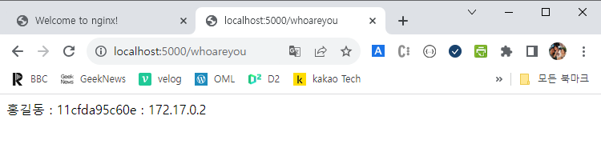
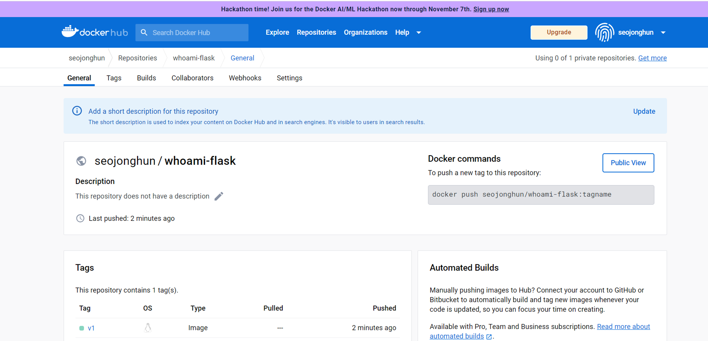

# 쿠버네티스 실습

아래 조건을 만족하는 플라스크 애플리케이션을 개발하고 쿠버네티스 클러스터에 배포해 보세요.

플라스크 애플리케이션은 /whoareyou 요청에 대해 작성자 이름, 호스트 이름, IP 주소를 반환

예) 홍길동, hostname-deployment-7d4f978855-2kkw6, 10.0.0.4

플라스크 애플리케이션을 구동하는 컨테이너 이미지의 이름은 whoami-flask:v1 으로 설정해 본인의 도커 허브에 등록

디플로이먼트의 레플리카는 5개로 설정해서 배포하고, LoadBalancer 타입의 서비스를 이용해서 디플로이먼트를 연동

호스트의 이름 확인 

```powershell

vagrant@master-node:~$ kubectl run -it --rm busybox --image docker.io/busybox /bin/sh
If you don't see a command prompt, try pressing enter.
/ #
/ # env
KUBERNETES_SERVICE_PORT=443
KUBERNETES_PORT=tcp://172.17.0.1:443
HOSTNAME=busybox
SHLVL=1
HOME=/root
TERM=xterm
KUBERNETES_PORT_443_TCP_ADDR=172.17.0.1
PATH=/usr/local/sbin:/usr/local/bin:/usr/sbin:/usr/bin:/sbin:/bin
KUBERNETES_PORT_443_TCP_PORT=443
KUBERNETES_PORT_443_TCP_PROTO=tcp
KUBERNETES_SERVICE_PORT_HTTPS=443
KUBERNETES_PORT_443_TCP=tcp://172.17.0.1:443
KUBERNETES_SERVICE_HOST=172.17.0.1
PWD=/
```

### **#1 프로젝트 셋업**

```powershell
C:\kubernetes> python -m venv whoami-flask

C:\kubernetes> cd whoami-flask

C:\kubernetes\whoami-flask> Scripts\activate

(whoami-flask) C:\kubernetes\whoami-flask> pip install flask

(whoami-flask) C:\kubernetes\whoami-flask> code .
```

### **#2 플라스크 애플리케이션 제작**

```powershell
from flask import Flask
import os
import socket

app = Flask(__name__)

@app.route('/whoareyou')
def whoareyou():
    hostname = os.getenv('HOSTNAME', '')
    s = socket.socket(socket.AF_INET, socket.SOCK_DGRAM)
    s.connect(("8.8.8.8", 53))
    ip = s.getsockname()[0]
    s.close()
    name = '홍길동'

    return name + " : " + hostname + " : " + ip

app.run(host="0.0.0.0",port=5000)
```

# #3테스트

```powershell
 
(whoami-flask) C:\kubernetes\whoami-flask> set HOSTNAME=testhostname		⇐ 환경변수 설정
(whoami-flask) C:\kubernetes\whoami-flask> python app.py
 * Serving Flask app 'app'
 * Debug mode: off
WARNING: This is a development server. Do not use it in a production deployment. Use a production WSGI server instead.
 * Running on all addresses (0.0.0.0)
 * Running on http://127.0.0.1:5000
 * Running on http://172.20.132.191:5000
Press CTRL+C to quit
```

https://lh4.googleusercontent.com/lmkZUXuj7HpobPiqrBBhx_xsfd8HzOB45tEUZ_u6EJS623pleFbzTxnPim-fC1ogqDoFPdoTTMS32L_rENc3mqU2s-YDftVGrKEateC_uTuSXqZJmNiiekVgd1gHxTP42L7tWQ5_YGa7IEUeetlTV-M

### **#4 requirements.txt 파일 생성**

```powershell
(whoami-flask) C:\kubernetes\whoami-flask> pip freeze > requirements.txt
(whoami-flask) C:\kubernetes\whoami-flask> type requirements.txt
```

****#5 Dockerfile 작성****

```powershell
C:\kubernetes\whoami-flask\Dockerfile
FROM     python
WORKDIR  /app
COPY     app.py .
COPY     requirements.txt .
RUN      pip install -r requirements.txt
CMD      ["python", "/app/app.py"]
```

****#6 이미지 빌드****

```powershell
(whoami-flask) C:\kubernetes\whoami-flask> docker image build -t seojonghun/whoami-flask:v1 .
(whoami-flask) C:\kubernetes\whoami-flask> docker image ls
REPOSITORY              TAG  IMAGE ID       CREATED          SIZE
seojonghun/whoami-flask   v1   611c4415e509   12 seconds ago   1.03GB
```

****#7 컨테이너 실행 및 테스트****

```powershell
(whoami-flask) C:\kubernetes\whoami-flask> docker container run --rm -p 5000:5000 seojonghun/whoami-flask:v1
 * Serving Flask app 'app'
 * Debug mode: off
WARNING: This is a development server. Do not use it in a production deployment. Use a production WSGI server instead.
 * Running on all addresses (0.0.0.0)
 * Running on http://127.0.0.1:5000
 * Running on http://172.17.0.2:5000
Press CTRL+C to quit
```



### **#8 이미지 등록**

```powershell
(whoami-flask) C:\kubernetes\whoami-flask> docker image push seojonghun/whoami-flask:v1
```



****#9 디플로이먼트와 서비스 매니페스트 파일 작성****

```powershell
apiVersion: apps/v1
kind: Deployment
metadata:
  name: whoami-flask-deployment
spec:
  replicas: 5
  selector:
    matchLabels:
      app: whoami-flask
  template:
    metadata:
      name: whoami-flask-pod
      labels:
        app: whoami-flask
    spec:
      containers:
      - name: whoami-flask-container
        image: docker.io/seojonghun/whoami-flask:v1
        ports:
        - containerPort: 5000
      imagePullSecrets:
      - name: regcred
---
apiVersion: v1
kind: Service
metadata:
  name: whoami-flask-service
spec:
  type: LoadBalancer
  ports:
  - name: whoami-flask
    port: 5000
    targetPort: 5000
  selector:
    app: whoami-flask
```

****#10 디플로이먼트와 서비스 생성****

```powershell
vagrant@master-node:~$ kubectl apply -f whoami-flask.yaml
deployment.apps/whoami-flask-deployment created
service/whoami-flask-service created

vagrant@master-node:~$ kubectl get deployment,pod,service
NAME                                      READY   UP-TO-DATE   AVAILABLE   AGE
deployment.apps/whoami-flask-deployment   5/5     5            5           11s

NAME                                           READY   STATUS    RESTARTS   AGE
pod/whoami-flask-deployment-67b9b55c7f-682z5   1/1     Running   0          10s
pod/whoami-flask-deployment-67b9b55c7f-lgh9f   1/1     Running   0          10s
pod/whoami-flask-deployment-67b9b55c7f-v4rpj   1/1     Running   0          10s
pod/whoami-flask-deployment-67b9b55c7f-x425l   1/1     Running   0          10s
pod/whoami-flask-deployment-67b9b55c7f-xbsdl   1/1     Running   0          10s

NAME                           TYPE           CLUSTER-IP     EXTERNAL-IP   PORT(S)          AGE
service/kubernetes             ClusterIP      172.17.0.1     <none>        443/TCP          5d17h
service/whoami-flask-service   LoadBalancer   172.17.1.223   10.0.0.3      5000:30386/TCP   10s
```

****#11 로드밸런서 IP로 접근했을 때 다섯 개의 파드로 요청이 분배되는 것을 확인****