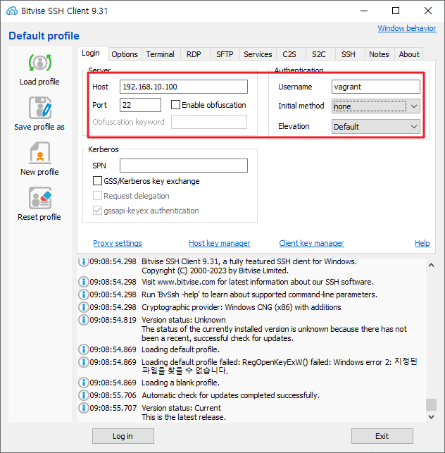
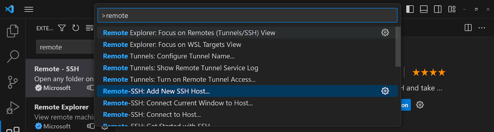
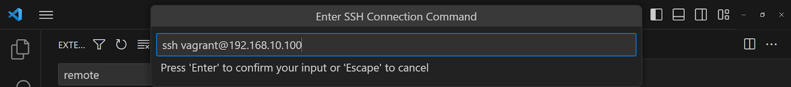
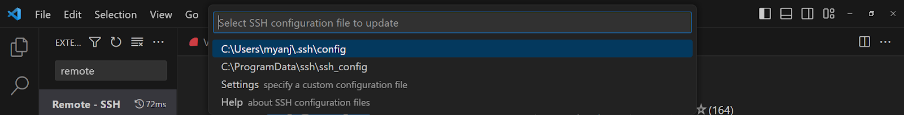
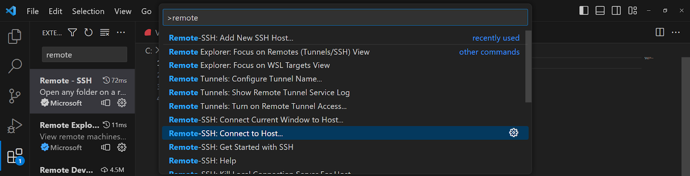
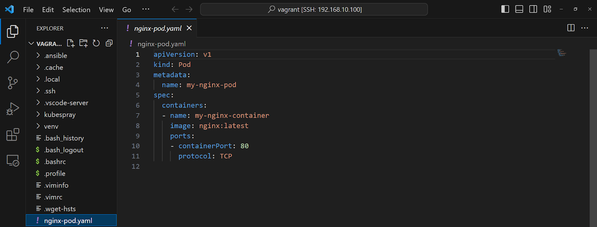

# 파드생성과 같은 클러스터내에 있는 노드에 IP로 접속

# **SSH Client**

https://www.bitvise.com/ssh-client-download

Bitvise



## **nginx 컨테이너로 구성된 파드를 생성**

### **CLI**

```powershell
nginx 컨테이너로 구성된 파드를 생성
CLI 
root@master:/home/vagrant# kubectl run my-nginx-pod-cli --image=nginx:latest --port 80
pod/my-nginx-pod-cli created           ~~~~~~~~~~~~~~~~ ~~~~~~~~~~~~~~~~~~~~ ~~~~~~~~~  
                                       파드 이름        파드 생성에 사용할 이미지     컨테이너에서 사용하는 포트
root@master:/home/vagrant# kubectl get pod
NAME               READY   STATUS              RESTARTS   AGE
my-nginx-pod-cli   0/1     ContainerCreating   0          7s

root@master:/home/vagrant# kubectl get pod
NAME               READY   STATUS    RESTARTS   AGE
my-nginx-pod-cli   1/1     Running   0          2m12s
```

### **YAML**

```powershell
root@master:/home/vagrant# **vi nginx-pod.yaml**

apiVersion: v1				# YAML 파일에서 정의한 오브젝트의 API 버전

kind: Pod				# 리소스의 종류 ( kubectl api-resources 명령의 KIND 항목 )

metadata:				# 라벨, 주석(annotation), 이름과 같은 리소스의 부가 정의

name: my-nginx-pod

spec:					# 리소스 생성을 위한 정보

containers:

- name: my-nginx-container

image: nginx:latest

ports:

- containerPort: 80

protocol: TCP
```

```powershell
root@master:/home/vagrant# kubectl apply -f nginx-pod.yaml
pod/my-nginx-pod created

root@master:/home/vagrant# kubectl get pod
NAME               READY   STATUS              RESTARTS   AGE
my-nginx-pod       0/1     ContainerCreating   0          4s
my-nginx-pod-cli   1/1     Running             0          11m

root@master:/home/vagrant# kubectl get pod
NAME               READY   STATUS    RESTARTS   AGE
my-nginx-pod       1/1     Running   0          30s
my-nginx-pod-cli   1/1     Running   0          11m
```

## **kubectl get pod로 표시되는 STATUS**

https://kubernetes.io/docs/concepts/workloads/pods/pod-lifecycle/

| Value | Description |
| --- | --- |
| ContainerCreating | 이미지를 다운로드 중이거나 컨테이너를 생성하는 중을 의미
컨피그맵, 시크릿이 마운트되지 않아 컨테이너 생성이 보류 중을 의미 |
| CrashLoopBackOff | 파드 내의 컨테이너가 종료되어 다음 기동 시까지 대기 상태에 있음을 의미 |
| Pending | The Pod has been accepted by the Kubernetes cluster, but one or more of the containers has not been set up and made ready to run. This includes time a Pod spends waiting to be scheduled as well as the time spent downloading container images over the network. |
| Running | The Pod has been bound to a node, and all of the containers have been created. At least one container is still running, or is in the process of starting or restarting. |
| Terminating | 컨테이너에 종료 요청 시그널을 보낸 후 컨테이너가 종료할 때까지 대기 중을 의미 |
| Succeeded | All containers in the Pod have terminated in success, and will not be restarted. |
| Completed | 파드 내 컨테이너가 정상적으로 종료되었음을 의미
파드 내에 복수의 컨테어니가 있는 경우, 첫 번째 컨테이너가 정상 종료하면 Completed가 표시 |
| Error | 컨테이너가 이상 종료된 경우 
파드 내에 복수의 컨테어니가 있는 경우, 첫 번째 컨테이너가 이상 종료하면 Error가 표시 |
| Failed | All containers in the Pod have terminated, and at least one container has terminated in failure. That is, the container either exited with non-zero status or was terminated by the system. |
| Unknown | For some reason the state of the Pod could not be obtained. This phase typically occurs due to an error in communicating with the node where the Pod should be running. |

## **생성된 리소스의 자세한 정보를 확인**

```powershell
root@master:/home/vagrant# kubectl **describe** pods my-nginx-pod
```

```powershell
root@master:/home/vagrant# kubectl get pod -o wide
NAME               READY   STATUS    RESTARTS   AGE   IP               NODE      NOMINATED NODE   READINESS GATES
my-nginx-pod       1/1     Running   0          17m   10.233.125.6     worker2   <none>           <none>
my-nginx-pod-cli   1/1     Running   0          28m   10.233.105.131   worker1   <none>           <none>
```

## **nginx 동작 확인**

### **클러스터 내부에서 nginx 파드 동작을 확인 (클러스터 내의 노드에서 실행)**

```powershell
root@master:/home/vagrant# curl 10.233.125.6 		⇐ 클러스터를 구성하고 있는 master 노드에서 파드 IP로 접근
```

```powershell
<!DOCTYPE html>
<html>
<head>
<title>Welcome to nginx!</title>
<style>
html { color-scheme: light dark; }
body { width: 35em; margin: 0 auto;
font-family: Tahoma, Verdana, Arial, sans-serif; }
</style>
</head>
<body>
<h1>Welcome to nginx!</h1>
<p>If you see this page, the nginx web server is successfully installed and
working. Further configuration is required.</p>

<p>For online documentation and support please refer to
<a href="http://nginx.org/">nginx.org</a>.<br/>
Commercial support is available at
<a href="http://nginx.com/">nginx.com</a>.</p>

<p><em>Thank you for using nginx.</em></p>
</body>
</html>
```

```powershell
root@master:/home/vagrant# ssh [vagrant@192.168.10.110](mailto:vagrant@192.168.10.110)	⇐ worker-1 노드로 접속
```

```powershell
vagrant@worker-1:~$ curl 10.233.125.6	⇐ 클러스터를 구성하고 있는 worker-1 노드에서 파드 IP로 접근
```

### **클러스터 내부에 테스트 용도의 파드를 임시로 생성해서 nginx 파드의 동작을 확인 (클러스터 내의 노드에 접속이 어려운 경우)**

```powershell
root@master:/home/vagrant# kubectl run -it --rm debug --image=busybox --restart=Never sh
```

```powershell
If you don't see a command prompt, try pressing enter.
/ #
/ # wget -q -O - http://10.233.105.132
```

```powershell
<!DOCTYPE html>
<html>
<head>
<title>Welcome to nginx!</title>
<style>
html { color-scheme: light dark; }
body { width: 35em; margin: 0 auto;
font-family: Tahoma, Verdana, Arial, sans-serif; }
</style>
</head>
<body>
<h1>Welcome to nginx!</h1>
<p>If you see this page, the nginx web server is successfully installed and
working. Further configuration is required.</p>

<p>For online documentation and support please refer to
<a href="http://nginx.org/">nginx.org</a>.<br/>
Commercial support is available at
<a href="http://nginx.com/">nginx.com</a>.</p>

<p><em>Thank you for using nginx.</em></p>
</body>
</html>
/ #
```

다른 터미널에서 파드 상태를 확인 ⇒ 노드의 경계를 넘어서 출력된 IP를 기반으로 파드간 통신이 가능

```powershell
root@master:/home/vagrant# kubectl get pod -o wide
```

```powershell
NAME               READY   STATUS    RESTARTS   AGE     IP               NODE      NOMINATED NODE   READINESS GATES
debug              1/1     Running   0          2m42s   10.233.105.132   worker1   <none>           <none>
my-nginx-pod       1/1     Running   0          35m     10.233.125.6     worker2   <none>           <none>
my-nginx-pod-cli   1/1     Running   0          46m     10.233.105.131   worker1   <none>           <none>
```

### **테스트용 파드를 빠져나오면 해당 파드는 삭제되는 것을 확인**

```powershell
/ # exit

pod "debug" deleted

root@master:/home/vagrant# kubectl get pods

NAME               READY   STATUS    RESTARTS   AGE
my-nginx-pod       1/1     Running   0          38m
my-nginx-pod-cli   1/1     Running   0          49m
```

## **kubectl exec 명령으로 파드의 컨테이너에 명령어를 전달**

```powershell
root@master:/home/vagrant# kubectl exec -it my-nginx-pod **--** /bin/bash
~~~~~~~~~~~~    ~~~~~~~~~
파드 이름       파드 내의 컨테이너에서 실행할 명령어
root@my-nginx-pod:/# ls /etc/nginx/
conf.d          mime.types  nginx.conf   uwsgi_params
fastcgi_params  modules     scgi_params
root@my-nginx-pod:/# exit
exit
root@master:/home/vagrant#
```

## **kubectl logs 명령으로 파드의 로그를 확인**

```powershell
root@master:/home/vagrant# kubectl logs my-nginx-pod	⇐ 파드의 표준 출력 로그를 확인
```

## **kubectl delete -f 명령으로 쿠버네티스 오브젝트를 삭제**

```powershell
root@master:/home/vagrant# kubectl delete -f nginx-pod.yaml	⇐ nginx-pod.yaml 파일에 정의된 오브젝트를 삭제
```

```powershell
pod "my-nginx-pod" deleted						   kubectl delete pod my-nginx-pod 와 동일
```

# **VSCode Extention 설치**

```powershell
C:\kubernetes> code .
```

Remote - SSH 확장 프로그램 설치












# **쿠버네트스가 파드를 사용하는 이유**

여러 리눅스 네임스페이스를 공유하는 **여러 컨테이너들을 추상화된 집합으로 사용**하기 위함

```powershell
/home/vagrant/**nginx-pod-with-ubuntu.yaml**
```

---

경로로 가서 Yaml 파일 작성