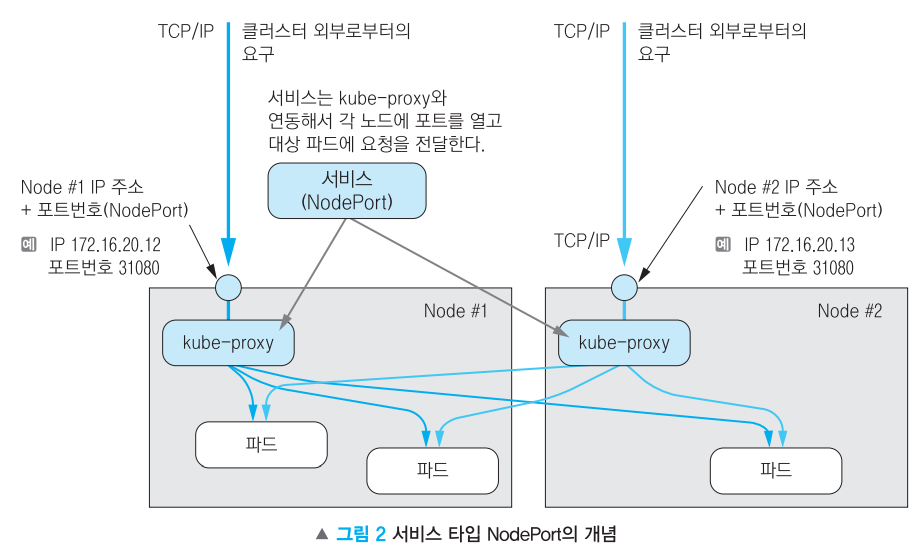
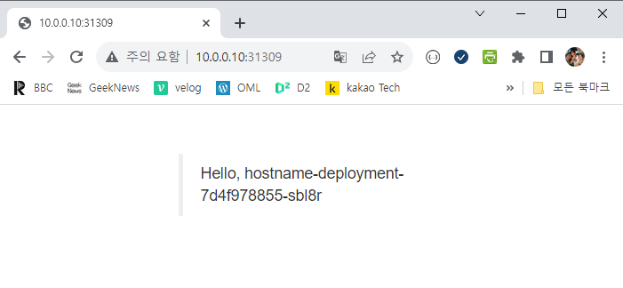

# NodePort

## **NodePort 타입의 서비스**

모든 노드의 특정 포트를 개방해 서비스에 접근하는 방식

노드의 IP 주소에 공개 포트를 오픈 → 클러스터 외부에서 클러스터 내부의 파드로 요청을 전달하는 것이 가능


기본적으로 30,000 ~ 32,767 범위



### **#1 디플로이먼트 생성**

/home/vagrant/hostname-deployment.yaml 그대로 사용

```powershell
apiVersion: apps/v1
kind: Deployment
metadata:
  name: hostname-deployment
spec:
  replicas: 3
  selector:
    matchLabels:
      app: webserver
  template:
    metadata:
      labels:
        app: webserver
      name: my-webserver
    spec:
      containers:
      - name: my-webserver
        image: docker.io/alicek106/rr-test:echo-hostname
        ports:
        - containerPort: 80
      imagePullSecrets:
      - name: regcred
```

```powershell
vagrant@master-node:~$ kubectl apply -f hostname-deployment.yaml
deployment.apps/hostname-deployment created

vagrant@master-node:~$ kubectl get deployment
NAME                  READY   UP-TO-DATE   AVAILABLE   AGE
hostname-deployment   3/3     3            3           18s

vagrant@master-node:~$ kubectl get pod -o wide
NAME                                   READY   STATUS    RESTARTS   AGE   IP              NODE            NOMINATED NODE   READINESS GATES
hostname-deployment-7d4f978855-7sh46   1/1     Running   0          35s   172.16.158.15   worker-node02   <none>           <none>
hostname-deployment-7d4f978855-bctmb   1/1     Running   0          35s   172.16.87.236   worker-node01   <none>           <none>
hostname-deployment-7d4f978855-sbl8r   1/1     Running   0          35s   172.16.158.16   worker-node02   <none>           <none>
```

### **#2 서비스 정의**

```powershell
/home/vagrant/**hostname-service-nodeport.yaml

apiVersion: v1
kind: Service
metadata:
  name: hostname-service-nodeport
spec:
  type: NodePort
  ports:
  - name: web-port
    port: 8080
    targetPort: 80
  selector:
    app: webserver**
```

**#3 서비스 생성 및 확인**

```powershell
vagrant@master-node:~$ kubectl apply -f hostname-service-nodeport.yaml
service/hostname-service-nodeport created

vagrant@master-node:~$ kubectl get service
NAME                        TYPE        CLUSTER-IP     EXTERNAL-IP   PORT(S)          AGE
hostname-service-nodeport   NodePort    172.17.50.41   <none>        8080:31309/TCP   18s
                                                                          ~~~~~
                                                                          공개 포트
                                                                          모든 노드에서 동일하게 접근할 수 있는 포트
kubernetes                  ClusterIP   172.17.0.1     <none>        443/TCP          4d22h
```

### **#4 클러스터 내에서 모든 노드의 INTERNAL-IP 또는 EXTERNAL-IP와 노드 공개 포트로 접근이 가능**

```powershell
vagrant@master-node:~$ kubectl get node -o wide
NAME            STATUS   ROLES           AGE     VERSION   INTERNAL-IP   EXTERNAL-IP   OS-IMAGE             KERNEL-VERSION      CONTAINER-RUNTIME
master-node     Ready    control-plane   4d22h   v1.27.1   10.0.0.10     <none>        Ubuntu 22.04.3 LTS   5.15.0-83-generic   cri-o://1.27.1
worker-node01   Ready    worker          4d22h   v1.27.1   10.0.0.11     <none>        Ubuntu 22.04.3 LTS   5.15.0-83-generic   cri-o://1.27.1
worker-node02   Ready    worker          4d22h   v1.27.1   10.0.0.12     <none>        Ubuntu 22.04.3 LTS   5.15.0-83-generic   cri-o://1.27.1
```

```powershell
vagrant@master-node:~$ kubectl get pods -o wide
NAME                                   READY   STATUS    RESTARTS   AGE     IP              NODE            NOMINATED NODE   READINESS GATES
hostname-deployment-7d4f978855-7sh46   1/1     Running   0          9m59s   172.16.158.15   worker-node02   <none>           <none>
hostname-deployment-7d4f978855-bctmb   1/1     Running   0          9m59s   172.16.87.236   worker-node01   <none>           <none>
hostname-deployment-7d4f978855-sbl8r   1/1     Running   0          9m59s   172.16.158.16   worker-node02   <none>           <none>
```

### master 노드의 공개 포트로 요청을 전달

```powershell
vagrant@master-node:~$ wget -q -O - http://10.0.0.10:31309 | grep Hello
        <p>Hello,  hostname-deployment-7d4f978855-sbl8r</p>     </blockquote>	⇐ node02에 배치된 파드가 응답
vagrant@master-node:~$ wget -q -O - http://10.0.0.10:31309 | grep Hello
        <p>Hello,  hostname-deployment-7d4f978855-bctmb</p>     </blockquote>	⇐ node01에 배치된 파드가 응답
vagrant@master-node:~$ wget -q -O - http://10.0.0.10:31309 | grep Hello
        <p>Hello,  hostname-deployment-7d4f978855-7sh46</p>     </blockquote>	⇐ node02에 배치된 파드가 응답
```

### node01 노드의 공개 포트로 요청을 전달

```powershell
vagrant@master-node:~$ wget -q -O - http://10.0.0.11:31309 | grep Hello
        <p>Hello,  hostname-deployment-7d4f978855-bctmb</p>     </blockquote>	⇐ node01에 배치된 파드가 응답
vagrant@master-node:~$ wget -q -O - http://10.0.0.11:31309 | grep Hello
        <p>Hello,  hostname-deployment-7d4f978855-7sh46</p>     </blockquote>	⇐ node02에 배치된 파드가 응답
vagrant@master-node:~$ wget -q -O - http://10.0.0.11:31309 | grep Hello
        <p>Hello,  hostname-deployment-7d4f978855-sbl8r</p>     </blockquote>	⇐ node02에 배치된 파드가 응답
```

### 서비스 이름으로 접근은 불가

```powershell
vagrant@master-node:~$ wget -O - http://hostname-service-nodeport:31309
--2023-10-10 07:39:21--  http://hostname-service-nodeport:31309/
Resolving hostname-service-nodeport (hostname-service-nodeport)... failed: Temporary failure in name resolution.
wget: unable to resolve host address ‘hostname-service-nodeport’
```

#5 클러스터 내에서 서비스의 서비스 이름 또는 CLUSTER-IP와 ClusterIP 서비스 포트를 이용한 접근도 가능
NodePort 타입의 서비스가 ClusterIP 타입의 서비스 기능을 포함하고 있으므로 클러스터에서 서비스의 내부 IP와 DNS 이름을 용한 접근이 가능

```powershell
vagrant@master-node:~$ kubectl get service

NAME                        TYPE        CLUSTER-IP     EXTERNAL-IP   PORT(S)          AGE
hostname-service-nodeport   NodePort    172.17.50.41   <none>        8080:31309/TCP   14m
kubernetes                  ClusterIP   172.17.0.1     <none>        443/TCP          4d22h

vagrant@master-node:~$ wget -q -O - http://172.17.50.41:8080 | grep Hello
        <p>Hello,  hostname-deployment-7d4f978855-bctmb</p>     </blockquote>
vagrant@master-node:~$ wget -q -O - http://172.17.50.41:8080 | grep Hello
        <p>Hello,  hostname-deployment-7d4f978855-sbl8r</p>     </blockquote>
vagrant@master-node:~$ wget -q -O - http://172.17.50.41:8080 | grep Hello
        <p>Hello,  hostname-deployment-7d4f978855-7sh46</p>     </blockquote>
```

```powershell
vagrant@master-node:~$ kubectl run debug -it --rm --image busybox /bin/sh
If you don't see a command prompt, try pressing enter.
/ #
/ #
/ # wget -q -O - http://172.17.50.41:8080 | grep Hello
        <p>Hello,  hostname-deployment-7d4f978855-7sh46</p>     </blockquote>
/ # wget -q -O - http://172.17.50.41:8080 | grep Hello
        <p>Hello,  hostname-deployment-7d4f978855-bctmb</p>     </blockquote>
/ # wget -q -O - http://172.17.50.41:8080 | grep Hello
        <p>Hello,  hostname-deployment-7d4f978855-sbl8r</p>     </blockquote>
```

### **#6 호스트 PC(내 PC)의 웹 브라우저를 이용한 접근도 가능**

http://10.0.0.10:31309/

http://10.0.0.11:31309/

http://10.0.0.12:31309/	⇐ 어느 노드로 접근하더라도 각 파드로 요청이 분배되어 처리되는 것을 확인할 수 있음

//10.0.0.12:31309/	⇐ 어느 노드로 접근하더라도 각 파드로 요청이 분배되어 처리되는 것을 확인할 수 있음



### **#7 리소스 정리**