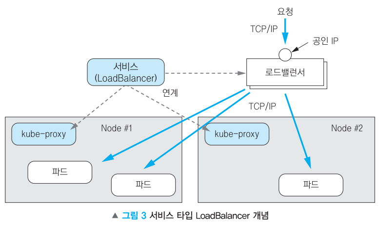

# 로드밸런서

## **LoadBalancer 타입의 서비스**

일반적으로 온프레미스 환경에서는 NodePort 타입의 서비스를 사용하고, 퍼블릭 클라우드 환경에서는 LoadBalancer 타입의 서비스를 사용해서 애플리케이션을 외부에 노출

### **로드밸런서**

서버에 가해지는 부하는 분산해 주는 장치 또는 기술을 통칭

### **L4 로드밸러서**

- 네트워크 계층 또는 트랜스포트 계층의 정보를 기반으로 부하 분산
- IP 주소 또는 PORT 주소를 이용
- 쿠버네티스에서 말하는 일반적인 로드밸런서는 L4 로드밸런서의 기능을 수행

### **L7 로드밸러서**

- 애플리케이션 계층의 정보를 기반으로 부하 분산
- URL, HTTP Header, Cookie 등과 같은 사용자 요청 정보를 이용
- 쿠버네티스에서 L7 로드밸런서 기능을 인그레스(Ingress)를 사용해 구현



## **TODO 클라우드 플랫폼에서 LoadBalancer 타입의 서비스를 연동**

## **온프레미스 환경에서 LoadBalancer 타입의 서비스를 연동**

x   
클러스터 내부에 로드밸런서 서비스를 받아 주는 구성이 필요 ⇒ MetalLB가 담당

### **#1 MetalLB**

https://metallb.universe.tf/

쿠버네티스 클러스터 내에서 로드 밸런싱을 제공하기 위한 오픈 소스 프로젝트

클라우드 공급자에서 실행되지 않는 클러스터에서 LoadBalancer 유형의 쿠버네티스 서비스 생성이 가능

### **#2 로드밸런서가 없는 환경에서 LoadBalancer 타입의 서비스를 노출**

```powershell
vagrant@master-node:~$ kubectl create deployment my-nginx --image=docker.io/nginx
deployment.apps/my-nginx created

vagrant@master-node:~$ kubectl get pod
NAME                       READY   STATUS    RESTARTS   AGE
my-nginx-9bcccb77c-xs7xz   1/1     Running   0          7s

vagrant@master-node:~$ kubectl expose deployment my-nginx --port 80 --type LoadBalancer
service/my-nginx exposed

vagrant@master-node:~$ kubectl get service
NAME         TYPE           CLUSTER-IP     EXTERNAL-IP   PORT(S)        AGE
kubernetes   ClusterIP      172.17.0.1     <none>        443/TCP        5d15h
my-nginx     LoadBalancer   172.17.53.19   <pending>     80:30416/TCP   9s
                                           ~~~~~~~~~
                                           로드밸런서가 존재하지 않기 때문에 Pending 상태가 지속
```

 #로드밸런서가 존재하지 않기 때문에 Pending 상태가 지속

# #****3 Service, Deployment 삭제****

```powershell
vagrant@master-node:~$ kubectl delete deployment my-nginx
deployment.apps "my-nginx" deleted
vagrant@master-node:~$ kubectl delete service my-nginx
service "my-nginx" deleted
vagrant@master-node:~$ kubectl get all
NAME                 TYPE        CLUSTER-IP   EXTERNAL-IP   PORT(S)   AGE
service/kubernetes   ClusterIP   172.17.0.1   <none>        443/TCP   5d15h

MetalLB 설치 ⇒ https://metallb.universe.tf/installation/
```

****#4 strictARP mode 활성화****

```powershell
vagrant@master-node:~$ kubectl get configmap kube-proxy -n kube-system -o yaml | \
> sed -e "s/strictARP: false/strictARP: true/" | \
> kubectl apply -f - -n kube-system
Warning: resource configmaps/kube-proxy is missing the kubectl.kubernetes.io/last-applied-configuration annotation which is required by kubectl apply. kubectl apply should only be used on resources created declaratively by either kubectl create --save-config or kubectl apply. The missing annotation will be patched automatically.
configmap/kube-proxy configured
```

****#5 MetalLB 설치****

```powershell
vagrant@master-node:~$ kubectl apply -f https://raw.githubusercontent.com/metallb/metallb/v0.13.11/config/manifests/metallb-native.yaml
namespace/metallb-system created
```

### **#6 LoadBalancer 서비스에 할당할 IP 대역을 정의 ⇒ VirtualBox Hosy-Only 네트워크 관리자의 설정을 확인**


```powershell
/home/vagrant/routing-config.yaml

apiVersion: metallb.io/v1beta1
kind: IPAddressPool
metadata:
  name: first-pool
  namespace: metallb-system
spec:
  addresses:
  - 10.0.0.3-10.0.0.254
---
apiVersion: metallb.io/v1beta1
kind: L2Advertisement
metadata:
  name: example
  namespace: metallb-system
spec:
  ipAddressPools:
  - first-pool
```

```powershell
vagrant@master-node:~$ kubectl apply -f routing-config.yaml -n metallb-system
ipaddresspool.metallb.io/first-pool created

vagrant@master-node:~$ kubectl get IPAddressPool -n metallb-system
NAME         AUTO ASSIGN   AVOID BUGGY IPS   ADDRESSES
first-pool   true          false             ["10.0.0.3-10.0.0.254"]
```

### **#7 디플로이먼트와 서비스를 생성 후 EXTERNAL-IP가 할당되는 것을 확인**

```powershell
vagrant@master-node:~$ kubectl create deployment my-nginx --image=docker.io/nginx
deployment.apps/my-nginx created

vagrant@master-node:~$ kubectl get deployment,pod
NAME                       READY   UP-TO-DATE   AVAILABLE   AGE
deployment.apps/my-nginx   1/1     1            1           10s

NAME                           READY   STATUS    RESTARTS   AGE
pod/my-nginx-9bcccb77c-cz6vj   1/1     Running   0          10s

vagrant@master-node:~$ kubectl expose deployment my-nginx --port 80 --type LoadBalancer
service/my-nginx exposed
```

```powershell
vagrant@master-node:~$ kubectl get service
NAME         TYPE           CLUSTER-IP      EXTERNAL-IP   PORT(S)        AGE
kubernetes   ClusterIP      172.17.0.1      <none>        443/TCP        5d16h
my-nginx     LoadBalancer   172.17.30.23    10.0.0.3      80:32257/TCP   7s
```

**#8 EXTERNAL-IP로 접속**

```powershell
vagrant@master-node:~$ wget -q -O - http://10.0.0.3
<!DOCTYPE html>
<html>
<head>
<title>Welcome to nginx!</title>
<style>
html { color-scheme: light dark; }
body { width: 35em; margin: 0 auto;
font-family: Tahoma, Verdana, Arial, sans-serif; }
</style>
</head>
<body>
<h1>Welcome to nginx!</h1>
<p>If you see this page, the nginx web server is successfully installed and
working. Further configuration is required.</p>

<p>For online documentation and support please refer to
<a href="http://nginx.org/">nginx.org</a>.<br/>
Commercial support is available at
<a href="http://nginx.com/">nginx.com</a>.</p>

<p><em>Thank you for using nginx.</em></p>
</body>
</html>
```

****#9 노드 IP와 노드 포트(공개 포트)로 접근****

```powershell
vagrant@master-node:~$ wget -q -O - http://10.0.0.10:32257

<!DOCTYPE html>
<html>
<head>
<title>Welcome to nginx!</title>
<style>
html { color-scheme: light dark; }
body { width: 35em; margin: 0 auto;
font-family: Tahoma, Verdana, Arial, sans-serif; }
</style>
</head>
<body>
<h1>Welcome to nginx!</h1>
<p>If you see this page, the nginx web server is successfully installed and
working. Further configuration is required.</p>

<p>For online documentation and support please refer to
<a href="http://nginx.org/">nginx.org</a>.<br/>
Commercial support is available at
<a href="http://nginx.com/">nginx.com</a>.</p>

<p><em>Thank you for using nginx.</em></p>
</body>
</html>
```

**#10 디플로먼트를 추가 생성 및 노출**

```powershell
vagrant@master-node:~$ kubectl apply -f hostname-deployment.yaml
deployment.apps/hostname-deployment created

vagrant@master-node:~$ kubectl get deploy
NAME                  READY   UP-TO-DATE   AVAILABLE   AGE
hostname-deployment   3/3     3            3           9s
my-nginx              1/1     1            1           35m

vagrant@master-node:~$ kubectl expose deployment hostname-deployment --port 80 --type LoadBalancer
service/hostname-deployment exposed
```

****#11 서비스 확인****

```powershell
vagrant@master-node:~$ kubectl get service
NAME                  TYPE           CLUSTER-IP     EXTERNAL-IP   PORT(S)        AGE
hostname-deployment   LoadBalancer   172.17.12.68   10.0.0.4      80:30368/TCP   38s
kubernetes            ClusterIP      172.17.0.1     <none>        443/TCP        5d16h
my-nginx              LoadBalancer   172.17.30.23   10.0.0.3      80:32257/TCP   5m28s

vagrant@master-node:~$ wget -q -O - http://10.0.0.4:80 | grep Hello
        <p>Hello,  hostname-deployment-7d4f978855-2kkw6</p>     </blockquote>
vagrant@master-node:~$ wget -q -O - http://10.0.0.4:80 | grep Hello
        <p>Hello,  hostname-deployment-7d4f978855-jjk8k</p>     </blockquote>
vagrant@master-node:~$ wget -q -O - http://10.0.0.4:80 | grep Hello
        <p>Hello,  hostname-deployment-7d4f978855-mwkt7</p>     </blockquote>
```

**#12 리소스 정리**
vagrant@master-node:~$ kubectl delete service my-nginx
service "my-nginx" deleted
vagrant@master-node:~$ kubectl delete service hostname-deployment
service "hostname-deployment" deleted
vagrant@master-node:~$ kubectl delete deployment my-nginx
deployment.apps "my-nginx" deleted
vagrant@master-node:~$ kubectl delete deployment hostname-deployment
deployment.apps "hostname-deployment" deleted
vagrant@master-node:~$ kubectl delete namespace metallb-system
namespace "metallb-system" deleted

vagrant@master-node:~$ kubectl get all
NAME                 TYPE        CLUSTER-IP   EXTERNAL-IP   PORT(S)   AGE
service/kubernetes   ClusterIP   172.17.0.1   <none>        443/TCP   5d16h
vagrant@master-node:~$ kubectl get namespace
NAME              STATUS   AGE
default           Active   5d16h
ingress-nginx     Active   5d
kube-node-lease   Active   5d16h
kube-public       Active   5d16h
kube-system       Active   5d16h