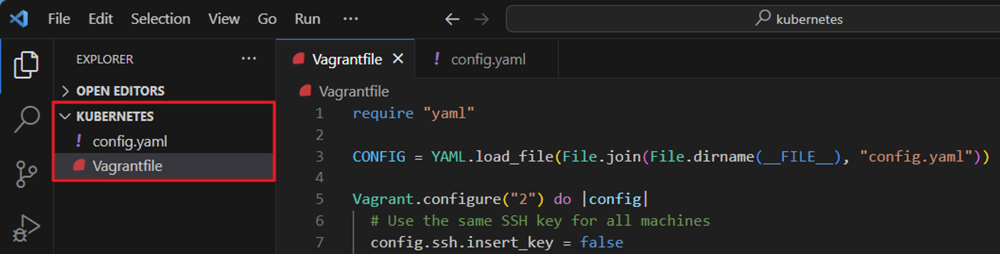
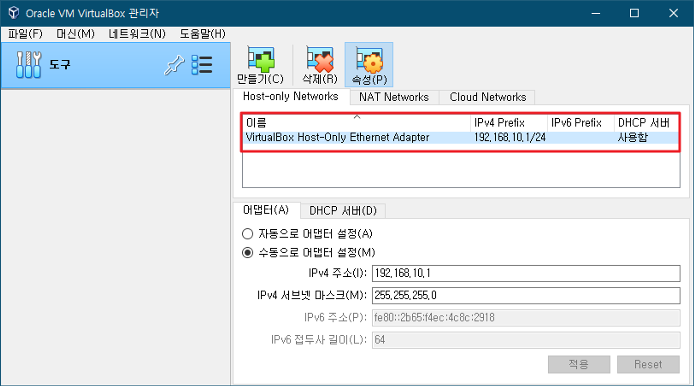
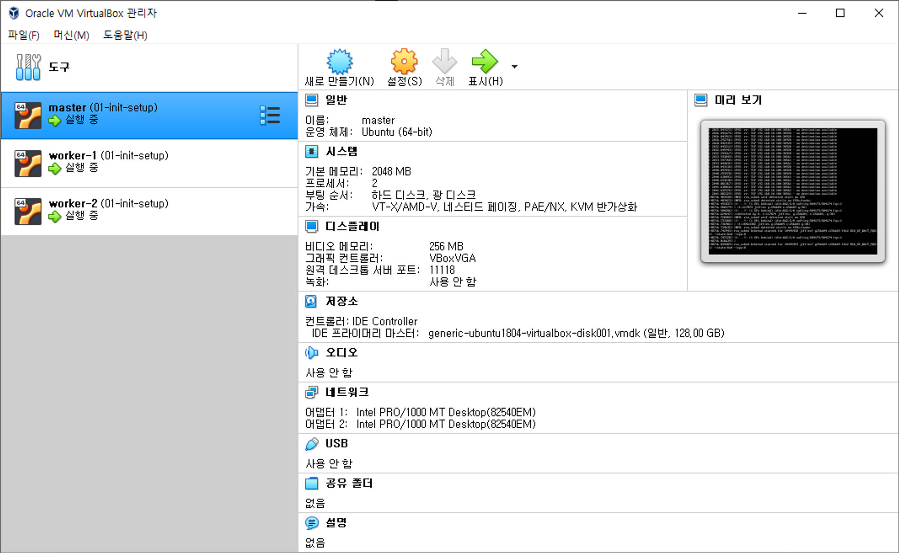

# 멀티 노드 클러스터링(kubespray)

# **kubespray를 활용한 멀티 노드 쿠버네티스 클러스터 구성**

https://myanjini.tistory.com/entry/Kubespray%EB%A5%BC-%ED%99%9C%EC%9A%A9%ED%95%9C-%EB%A9%80%ED%8B%B0-%EB%85%B8%EB%93%9C-%EC%BF%A0%EB%B2%84%EB%84%A4%ED%8B%B0%EC%8A%A4-%ED%81%B4%EB%9F%AC%EC%8A%A4%ED%84%B0-%EA%B5%AC%EC%84%B1

Vagrant 설치

https://developer.hashicorp.com/vagrant/downloads?product_intent=vagrant

# Kubespray

앤서블(ansible)을 사용해 쿠버네티스 클러스터를 구축하는 도구

# Vagrant

가상화 환경을 구축하고 관리하기 위한 오픈 소스 도구

가상 머신의 생성, 시작, 정지, 삭제 등의 작업을 CLI을 통해 간단하게 수행

다양한 가상화 플랫폼을 지원(VirtualBox, VMware, Hyper-V, Docker 등)

```powershell
vagrant init 		Vagrantfile을 생성

vagrant up		Vagrantfile을 기반으로 프로비저닝을 진행

vagrant halt		가상머신을 종료

vagrant destroy	가상머신을 삭제

vagrant ssh		가상머신에 SSH 접속

vagrant provision	가상머신의 설정을 변경하고 적용
```

https://lh6.googleusercontent.com/dJlL7YY1L6rjCwGZvPtkscUUdSaYOYLUso9obMHoLhAITlOcYOer1R-q9qkE_tk6JXWde5UMYaga9-5nYYhuK06-Kuf7pxmA0TlYPUw0thFtmN-gDxLtbGdmArnamRjtAY1CjWahRyytje65XOPuYVw

## # 01 작업디렉터리 생성 및 VSCode 실행

```
C:\> mkdir kubernetes
C:\> cd .\kubernetes\
C:\kubernetes> code .
```

## 02 Vagrant로 프로비저닝할 가상머신 설정

C:\kubernetes\Vagrantfile

```jsx
require "yaml"

CONFIG = YAML.load_file(File.join(File.dirname(__FILE__), "config.yaml"))

Vagrant.configure("2") do |config|
  # Use the same SSH key for all machines
  config.ssh.insert_key = false

  # masters
  CONFIG["masters"].each do |master|
    config.vm.define master["name"] do |cfg|
      cfg.vm.box = master["box"]
      cfg.vm.network "private_network", ip: master["ip"], virtualbox_intnet: true
      cfg.vm.hostname = master["hostname"]

      cfg.vm.provider "virtualbox" do |v|
        v.memory = master["memory"]
        v.cpus = master["cpu"]
        v.name = master["name"]
      end
      cfg.vm.provision "shell", inline: <<-SCRIPT
        sed -i -e "s/PasswordAuthentication no/PasswordAuthentication yes/g" /etc/ssh/sshd_config
        systemctl restart sshd
      SCRIPT

      # set timezone & disable swap memory, ufw & enable ip forwarding
      cfg.vm.provision "shell", inline: <<-SCRIPT
        sudo apt-get update
        sudo timedatectl set-timezone "Asia/Seoul"
        sudo swapoff -a
        sudo sed -i "/swap/d" /etc/fstab
        sudo systemctl stop ufw
        sudo systemctl disable ufw
        sudo sed -i "s/#net.ipv4.ip_forward=1/net.ipv4.ip_forward=1/" /etc/sysctl.conf
        sudo sysctl -p
      SCRIPT

      # install python
      cfg.vm.provision "shell", inline: <<-SCRIPT
        sudo apt install python3-pip python3-setuptools virtualenv -y
      SCRIPT
    end
  end

  # worker nodes
  CONFIG["workers"].each do |worker|
    config.vm.define worker["name"] do |cfg|
      cfg.vm.box = worker["box"]
      cfg.vm.network "private_network", ip: worker["ip"], virtualbox_intnet: true
      cfg.vm.hostname = worker["hostname"]

      cfg.vm.provider "virtualbox" do |v|
        v.memory = worker["memory"]
        v.cpus = worker["cpu"]
        v.name = worker["name"]
      end
      cfg.vm.provision "shell", inline: <<-SCRIPT
        sed -i -e "s/PasswordAuthentication no/PasswordAuthentication yes/g" /etc/ssh/sshd_config
        systemctl restart sshd
      SCRIPT

      # set timezone & disable swap memory & ufw & enable ip forwarding
      cfg.vm.provision "shell", inline: <<-SCRIPT
        sudo apt-get update
        sudo timedatectl set-timezone "Asia/Seoul"
        sudo swapoff -a
        sudo sed -i "/swap/d" /etc/fstab
        sudo systemctl stop ufw
        sudo systemctl disable ufw
        sudo sed -i "s/#net.ipv4.ip_forward=1/net.ipv4.ip_forward=1/" /etc/sysctl.conf
        sudo sysctl -p
      SCRIPT
    end
  end
end
```

C:\kubernetes\config.yaml - 생성할 가상머신의 하드웨어 사양을 정의

```jsx
masters:
  - name: master
    box: generic/ubuntu2204
    hostname: master
    ip: 192.168.10.100
    memory: 2048
    cpu: 2

workers:
  - name: worker-1
    box: generic/ubuntu2204
    hostname: worker-1
    ip: 192.168.10.110
    memory: 2048
    cpu: 2

  - name: worker-2
    box: generic/ubuntu2204
    hostname: worker-2
    ip: 192.168.10.120
    memory: 2048
    cpu: 2
```

## 03 파일 확인



## 04 VirtualBox 호스트 네트워크 관리자의 IPv4 주소 확인



## 05 가상머신 생성 및 확인

```bash
C:\kubernetes> vagrant up

C:\kubernetes> vagrant status
Current machine states:

master                    running (virtualbox)
worker-1                  running (virtualbox)
worker-2                  running (virtualbox)

This environment represents multiple VMs. The VMs are all listed
above with their current state. For more information about a specific
VM, run `vagrant status NAME`.
```


## 06 master 노드에서 SSH 공개키와 비밀키 생성

```bash
## 마스터 노드에 SSH 접속
c:\kubernetes> vagrant ssh master

## RSA 방식의 암호화 키 생성
vagrant@master:~$ ssh-keygen -t rsa
Generating public/private rsa key pair.
Enter file in which to save the key (/home/ubuntu/.ssh/id_rsa): ← 키 생성 위치(기본값 사용)
Created directory '/home/ubuntu/.ssh'.
Enter passphrase (empty for no passphrase):                   	← 최초 생성할 때 사용할 비밀번호(기본값 사용)
Enter same passphrase again:
Your identification has been saved in /home/ubuntu/.ssh/id_rsa.	← 비밀키
Your public key has been saved in /home/ubuntu/.ssh/id_rsa.pub.	← 공개키
The key fingerprint is:
SHA256:9JT7seFgcwZa9YXmvZx99YV+VVi66JEuMG1ReKCyFTc vagrant@bootstrap
The key's randomart image is:
+---[RSA 2048]----+
|        . Eoo  +o|
|         +.=..+o.|
|      . + *. ooo.|
|       = * + oo.=|
|      . S O O.o O|
|         = X =.+=|
|          . *  ..|
|           .     |
|                 |
+----[SHA256]-----+

## 키 생성 확인
vagrant@master:~$ ls -al .ssh/
total 20
drwx------ 2 vagrant vagrant 4096 Dec 20 08:57 .
drwxr-xr-x 5 vagrant vagrant 4096 Dec 20 08:42 ..
-rw------- 1 vagrant vagrant  409 Dec  4 01:44 authorized_keys
-rw------- 1 vagrant vagrant 1675 Dec 20 08:57 id_rsa
-rw-r--r-- 1 vagrant vagrant  399 Dec 20 08:57 id_rsa.pub

## 공개키 내용 확인
vagrant@master:~$ cat .ssh/id_rsa.pub
ssh-rsa AAAAB3NzaC1yc2EAAAADAQABAAABAQDQk0EmU3QOXtQe076hnMHommfsCz8gUwLPg90uytE/YxkB/+ARsQn0KzvnyufS7b/hVi7A6njTHFV+v2y2Kk4sW3NNW8cAwiI5cADAtAkbBmHQeF2SDR6VcDcFsQrnVOwKoX5usLq+23ZBk7I/rlJ48sa1/XtJ6fE+VNqe3VRMNo5ncPYUBRhqpeSnUD5IAbORUddKIMsUj4qX6V/3hUhcG5TU8nyJY82e5Nh2ZPvweBqfKbT3PLpd2RSyq2e7DgrPvGDAptUO6hWDheY0BXtRW8qz5sjgiXhrltySO5zWUngnM9dhu9F0t024QM9nJSWVdJ8qX78xe7ZAbXFECBt/
```

## 07 master 노드에서 모든 노드로 공개키를 배포

ansible은 각 서버가 실행할 스크립트를 SSH 통신으로 전송하므로, SSH 통신을 위한 키를 등록

```java
## 마스터 노드에 공개키 배포
vagrant@master:~$ ssh-copy-id vagrant@192.168.10.100
/usr/bin/ssh-copy-id: INFO: Source of key(s) to be installed: "/home/vagrant/.ssh/id_rsa.pub"
The authenticity of host '192.168.10.100 (192.168.10.100)' can't be established.
ED25519 key fingerprint is SHA256:VR7RCACx4HP7QWZuJfTZggMAxzPX/+C9Nn3IrWCLQlU.
This key is not known by any other names
Are you sure you want to continue connecting (yes/no/[fingerprint])? yes
/usr/bin/ssh-copy-id: INFO: attempting to log in with the new key(s), to filter out any that are already installed
/usr/bin/ssh-copy-id: INFO: 1 key(s) remain to be installed -- if you are prompted now it is to install the new keys
vagrant@192.168.10.100's password: vagrant                 <== 호스트 접속 패스워드 입력

Number of key(s) added: 1

Now try logging into the machine, with:   "ssh 'vagrant@192.168.10.100'"
and check to make sure that only the key(s) you wanted were added.

## 같은 방식으로 워커 노드에 공개키 배포
vagrant@master:~$ ssh-copy-id vagrant@192.168.10.110
vagrant@master:~$ ssh-copy-id vagrant@192.168.10.120
```

## 08 스냅샷 생성

```bash
## 스냅샷 생성
c:\kubernetes> vagrant snapshot save 01-init-state

## 스냅샷 생성 확인
c:\kubernetes> vagrant snapshot list
==> master:
01-init-state
==> worker-1:
01-init-state
==> worker-2:
01-init-state
```

## 

## 09 master 노드에 파이썬 가상환경 활성화

kubespray는 ansible을 이용하여 쿠버네티스 클러스터를 구성하므로, ansible을 사용하기 위해 파이썬 가상환경을 활성화

```bash
vagrant@master:~$ virtualenv --python=python3 venv
vagrant@master:~$ . venv/bin/activate
```

## 10 master 노드에서 kubespray 설치

```java
## kubespray 프로젝트 git clone
(venv) vagrant@master:~$ git clone https://github.com/kubernetes-sigs/kubespray(venv) vagrant@master:~$ cd kubespray

## kubespray 실행에 필요한 파이썬 패키지 확인
(venv) vagrant@master:~/kubespray$ ls
ansible.cfg         CONTRIBUTING.md  library         pipeline.Dockerfile        requirements.txt   setup.cfg
CHANGELOG.md        Dockerfile       LICENSE         playbooks                  reset.yml          setup.py
cluster.yml         docs             logo            plugins                    roles              test-infra
CNAME               extra_playbooks  Makefile        README.md                  run.rc             tests
code-of-conduct.md  galaxy.yml       meta            recover-control-plane.yml  scale.yml          upgrade-cluster.yml
_config.yml         index.html       OWNERS          RELEASE.md                 scripts            Vagrantfile
contrib             inventory        OWNERS_ALIASES  remove-node.yml            SECURITY_CONTACTS

(venv) vagrant@master:~/kubespray $ cat requirements.txt
ansible==7.6.0
cryptography==41.0.1
jinja2==3.1.2
jmespath==1.0.1
MarkupSafe==2.1.3
netaddr==0.8.0
pbr==5.11.1
ruamel.yaml==0.17.31
ruamel.yaml.clib==0.2.7

## kubespray 실행에 필요한 파이썬 패키지 설치
(venv) vagrant@master:~/kubespray$ pip install -r requirements.txt

## ansible 설치 확인
(venv) vagrant@master:~/kubespray$ ansible --version
ansible [core 2.14.10]
  config file = /home/vagrant/kubespray/ansible.cfg
  configured module search path = ['/home/vagrant/kubespray/library']
  ansible python module location = /home/vagrant/venv/lib/python3.10/site-packages/ansible
  ansible collection location = /home/vagrant/.ansible/collections:/usr/share/ansible/collections
  executable location = /home/vagrant/venv/bin/ansible
  python version = 3.10.12 (main, Jun 11 2023, 05:26:28) [GCC 11.4.0] (/home/vagrant/venv/bin/python)
  jinja version = 3.1.2
  libyaml = True
```

## 11 master 노드에서 ansible 인벤토리 파일을 설정

```java
## 샘플 인벤터리 복사
(venv) vagrant@master:~/kubespray$ cp -rfp inventory/sample inventory/mycluster

## 인벤토리 빌더를 이용해 인벤토리 파일을 업데이트
(venv) vagrant@master:~/kubespray$ declare -a IPS=(192.168.10.100 192.168.10.110 192.168.10.120)
(venv) vagrant@master:~/kubespray$ CONFIG_FILE=inventory/mycluster/hosts.yaml python3 contrib/inventory_builder/inventory.py ${IPS[@]}

## inventory/mycluster/hosts.yaml 파일 수정
(venv) vagrant@master:~/kubespray$ vi inventory/mycluster/hosts.yaml
all:
  hosts:
    master:
      ansible_host: 192.168.10.100
      ip: 192.168.10.100
      access_ip: 192.168.10.100
    worker1:
      ansible_host: 192.168.10.110
      ip: 192.168.10.110
      access_ip: 192.168.10.110
    worker2:
      ansible_host: 192.168.10.120
      ip: 192.168.10.120
      access_ip: 192.168.10.120
  children:
    kube_control_plane:
      hosts:
        master:
    kube_node:
      hosts:
        worker1:
        worker2:
    etcd:
      hosts:
        master:
    k8s_cluster:
      children:
        kube_control_plane:
        kube_node:
    calico_rr:
      hosts: {}
```

## 12 master 노드에서 kubespray 설치

```java
(venv) vagrant@bootstrap:~/kubespray$ ansible-playbook -i inventory/mycluster/hosts.yaml --become --become-user=root cluster.yml
			:
PLAY RECAP *************************************************************************************************************
localhost   : ok=3    changed=0    unreachable=0    failed=0    skipped=0    rescued=0    ignored=0
master      : ok=733  changed=62   unreachable=0    failed=0    skipped=1298 rescued=0    ignored=7
worker1     : ok=638  changed=53   unreachable=0    failed=0    skipped=1133 rescued=0    ignored=2
worker2     : ok=554  changed=38   unreachable=0    failed=0    skipped=818  rescued=0    ignored=1

Friday 29 September 2023  13:58:19 +0900 (0:00:00.268)       0:19:33.595 ******
===============================================================================
kubernetes/preinstall : Preinstall | wait for the apiserver to be running ------------------------------- 28.27s
etcdctl_etcdutl : Download_file | Download item --------------------------------------------------------- 24.89s
container-engine/containerd : Download_file | Download item --------------------------------------------- 22.92s
container-engine/runc : Download_file | Download item --------------------------------------------------- 22.37s
kubernetes/control-plane : Kubeadm | Initialize first master -------------------------------------------- 22.29s
container-engine/nerdctl : Download_file | Download item ------------------------------------------------ 20.81s
container-engine/crictl : Download_file | Download item ------------------------------------------------- 20.64s
kubernetes/kubeadm : Join to cluster -------------------------------------------------------------------- 20.10s
container-engine/crictl : Extract_file | Unpacking archive ---------------------------------------------- 18.45s
etcdctl_etcdutl : Extract_file | Unpacking archive ------------------------------------------------------ 16.50s
etcd : Gen_certs | Write etcd member/admin and kube_control_plane client certs to other etcd nodes ------ 14.30s
container-engine/nerdctl : Extract_file | Unpacking archive --------------------------------------------- 13.64s
network_plugin/calico : Start Calico resources ---------------------------------------------------------- 13.13s
kubernetes-apps/ansible : Kubernetes Apps | Start Resources --------------------------------------------- 13.10s
download : Download_file | Download item ---------------------------------------------------------------- 12.73s
etcdctl_etcdutl : Download_file | Validate mirrors ------------------------------------------------------ 12.11s
container-engine/runc : Download_file | Validate mirrors ------------------------------------------------ 12.02s
container-engine/containerd : Download_file | Validate mirrors ------------------------------------------ 11.75s
kubernetes/control-plane : Joining control plane node to the cluster. ----------------------------------- 11.56s
network_plugin/calico : Wait for calico kubeconfig to be created ---------------------------------------- 11.43s

## 가상환경 비활성화
(venv) vagrant@master:~$ deactivate

## root 사용자로 이동해서 노드 상태 확인
vagrant@master:~$ sudo su

root@master:/home/vagrant# kubectl get nodes
NAME      STATUS   ROLES           AGE   VERSION
master    Ready    control-plane   49m   v1.28.2
worker1   Ready    <none>          42m   v1.28.2
worker2   Ready    <none>          41m   v1.28.2

## 컴포넌트 상태 확인
root@master:/home/vagrant# kubectl get componentstatus
Warning: v1 ComponentStatus is deprecated in v1.19+
NAME                 STATUS    MESSAGE                         ERROR
controller-manager   Healthy   ok
scheduler            Healthy   ok
etcd-0               Healthy   {"health":"true","reason":""}

root@master:/home/vagrant# kubectl get --raw='/readyz?verbose'
[+]ping ok
[+]log ok
[+]etcd ok
[+]etcd-readiness ok
[+]informer-sync ok
[+]poststarthook/start-kube-apiserver-admission-initializer ok
[+]poststarthook/generic-apiserver-start-informers ok
[+]poststarthook/priority-and-fairness-config-consumer ok
[+]poststarthook/priority-and-fairness-filter ok
[+]poststarthook/storage-object-count-tracker-hook ok
[+]poststarthook/start-apiextensions-informers ok
[+]poststarthook/start-apiextensions-controllers ok
[+]poststarthook/crd-informer-synced ok
[+]poststarthook/start-service-ip-repair-controllers ok
[+]poststarthook/rbac/bootstrap-roles ok
[+]poststarthook/scheduling/bootstrap-system-priority-classes ok
[+]poststarthook/priority-and-fairness-config-producer ok
[+]poststarthook/start-system-namespaces-controller ok
[+]poststarthook/bootstrap-controller ok
[+]poststarthook/start-cluster-authentication-info-controller ok
[+]poststarthook/start-kube-apiserver-identity-lease-controller ok
[+]poststarthook/start-deprecated-kube-apiserver-identity-lease-garbage-collector ok
[+]poststarthook/start-kube-apiserver-identity-lease-garbage-collector ok
[+]poststarthook/start-legacy-token-tracking-controller ok
[+]poststarthook/aggregator-reload-proxy-client-cert ok
[+]poststarthook/start-kube-aggregator-informers ok
[+]poststarthook/apiservice-registration-controller ok
[+]poststarthook/apiservice-status-available-controller ok
[+]poststarthook/kube-apiserver-autoregistration ok
[+]autoregister-completion ok
[+]poststarthook/apiservice-openapi-controller ok
[+]poststarthook/apiservice-openapiv3-controller ok
[+]poststarthook/apiservice-discovery-controller ok
[+]shutdown ok
readyz check passed
```

## 13 스냅샷 생성
c:\kubernetes> vagrant snapshot save 02-k8s-clustering
==> master: Snapshotting the machine as '02-k8s-clustering'...
==> master: Snapshot saved! You can restore the snapshot at any time by
==> master: using `vagrant snapshot restore`. You can delete it using
==> master: `vagrant snapshot delete`.
==> worker-1: Snapshotting the machine as '02-k8s-clustering'...
==> worker-1: Snapshot saved! You can restore the snapshot at any time by
==> worker-1: using `vagrant snapshot restore`. You can delete it using
==> worker-1: `vagrant snapshot delete`.
==> worker-2: Snapshotting the machine as '02-k8s-clustering'...
==> worker-2: Snapshot saved! You can restore the snapshot at any time by
==> worker-2: using `vagrant snapshot restore`. You can delete it using
==> worker-2: `vagrant snapshot delete`.

c:\kubernetes> vagrant snapshot list
==> master:
01-init-state
02-k8s-clustering
==> worker-1:
01-init-state
02-k8s-clustering
==> worker-2:
01-init-state
02-k8s-clustering