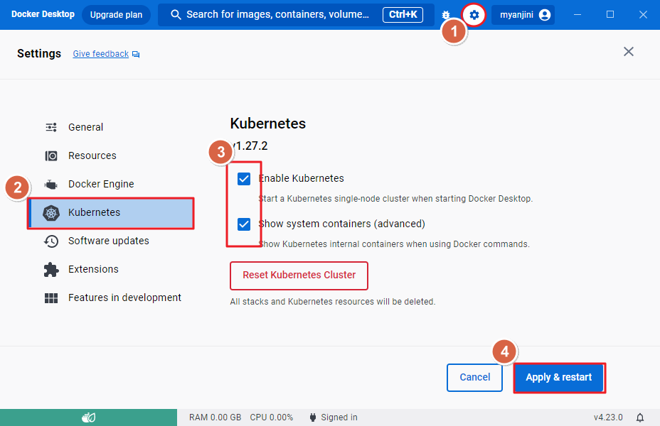
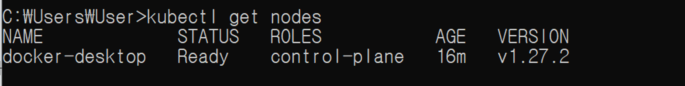
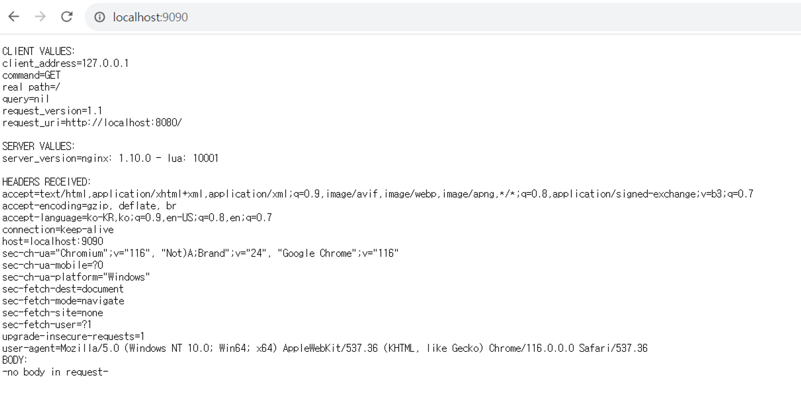

# 쿠버네티스 실행환경 설정후 실행(도커 데스크탑)

# **Docker Deskktop에서 Kubernetes 사용**




쿠버네티스 버전확인 

```python
	C:\Users\User> kubectl version
```

쿠버네티스 노드 확인



deployment : 파드단위를 배포

```python
C:\Users\User>kubectl create deployment hello-k8s --image=k8s.gcr.io/echoserver:1.4
deployment.apps/hello-k8s created
```

```python
C:\Users\User>kubectl get deployment
NAME        READY   UP-TO-DATE   AVAILABLE   AGE
hello-k8s   1/1     1            1           32s
```

```python
C:\Users\User>kubectl get deployment -o wide
NAME        READY   UP-TO-DATE   AVAILABLE   AGE   CONTAINERS   IMAGES                      SELECTOR
hello-k8s   1/1     1            1           95s   echoserver   [k8s.gcr.io/echoserver:1.4](http://k8s.gcr.io/echoserver:1.4)   app=hello-k8s
```

```python
C:\Users\User>kubectl get pod,replicaset,deployment -o wide
NAME                             READY   STATUS    RESTARTS   AGE     IP         NODE             NOMINATED NODE   READINESS GATES
pod/hello-k8s-75797f94b4-cx89p   1/1     Running   0          2m18s   10.1.0.7   docker-desktop   <none>           <none>

NAME                                   DESIRED   CURRENT   READY   AGE     CONTAINERS   IMAGES                      SELECTOR
replicaset.apps/hello-k8s-75797f94b4   1         1         1       2m18s   echoserver   k8s.gcr.io/echoserver:1.4   app=hello-k8s,pod-template-hash=75797f94b4

NAME                        READY   UP-TO-DATE   AVAILABLE   AGE     CONTAINERS   IMAGES                      SELECTOR
deployment.apps/hello-k8s   1/1     1            1           2m18s   echoserver   k8s.gcr.io/echoserver:1.4   app=hello-k8s
```

쿠버네티스 네트워크 서비스

```python
C:\Users\User>kubectl get service -o wide
NAME         TYPE        CLUSTER-IP   EXTERNAL-IP   PORT(S)   AGE   SELECTOR
kubernetes   ClusterIP   10.96.0.1    <none>        443/TCP   25m   <none>
```

쿠버네티스 명세 상세보기

```python
C:\Users\User>kubectl get all
NAME                             READY   STATUS    RESTARTS   AGE
pod/hello-k8s-75797f94b4-cx89p   1/1     Running   0          4m14s

NAME                 TYPE        CLUSTER-IP   EXTERNAL-IP   PORT(S)   AGE
service/kubernetes   ClusterIP   10.96.0.1    <none>        443/TCP   26m

NAME                        READY   UP-TO-DATE   AVAILABLE   AGE
deployment.apps/hello-k8s   1/1     1            1           4m14s

NAME                                   DESIRED   CURRENT   READY   AGE
replicaset.apps/hello-k8s-75797f94b4   1         1         1       4m14s
```

노트포트를 이용해 포트포워딩

# 노드포트 : 클러스터 외부에서 컨테이너화된 애플리케이션에 액세스할 수 있도록 하는 방법 중 하나

```python
C:\Users\User>kubectl expose deployment hello-k8s --type=NodePort --port=8080
service/hello-k8s exposed
```

```python
C:\Users\User>kubectl get service -o wide
NAME         TYPE        CLUSTER-IP       EXTERNAL-IP   PORT(S)          AGE   SELECTOR
hello-k8s    NodePort    10.100.143.222   <none>        8080:30811/TCP   35s   app=hello-k8s
kubernetes   ClusterIP   10.96.0.1        <none>        443/TCP          32m   <none>
```

```python
C:\Users\User>kubectl port-forward service/hello-k8s 9090:8080
Forwarding from 127.0.0.1:9090 -> 8080
Forwarding from [::1]:9090 -> 8080
Handling connection for 9090
Handling connection for 9090
```

로컬호스트 9090으로 접속(에코서버)
